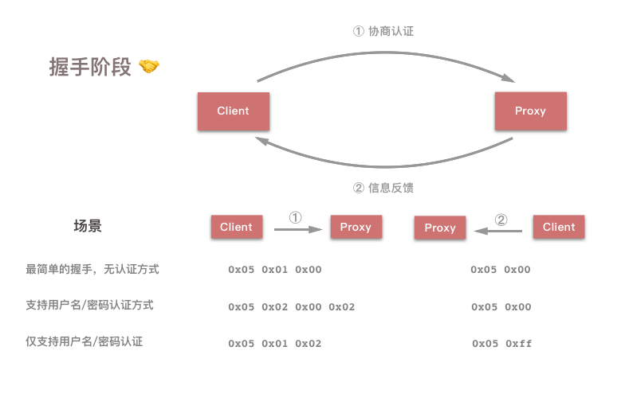
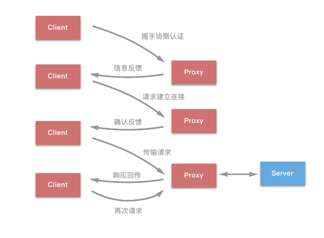
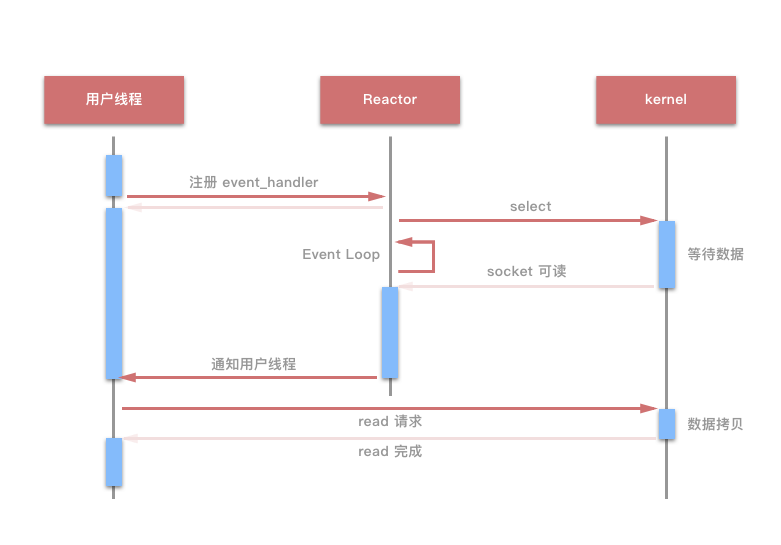
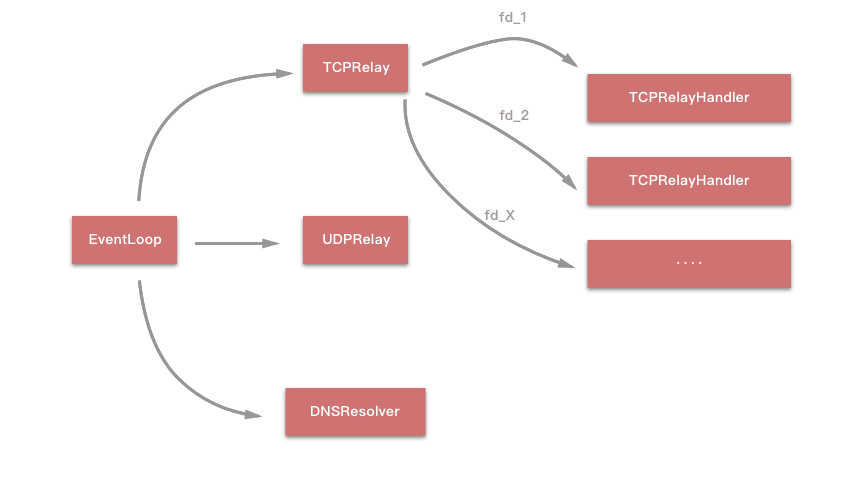

## #define 爱国 科学

最近 Apple Store 在大陆下架了所有 VPN 应用。然而日常的爱国上网已经成为了刚需。这也就是促使我阅读 Shadowsocks 源码的原因。希望后期可以自行编写移动设备的 Client 端而努力。

## Shadowsocks 的原理初探

关于 Shadowsocks 的原理，有一张经典的图示解释的十分清晰：

（该图引用自 [vc2tea · 写给非专业人士看的 Shadowsocks 简介](http://vc2tea.com/whats-shadowsocks/)）

Shadowsocks 是将原先的 ssh 创建的 Sock5 协议分成了 Server 端和 Client 端，这是一种类 **ssh tunnel** 的解决方案。

客户端发出的 Socks5 协议与 SS Local 进行通信以后，由于 SS Local 是当前使用端或是一个路由器越过 GFW，与 SS Server 进行通信，避免了 GFW 的分析干扰问题。并且在 SS Local 和 SS Server 两端可通过各种各样的加密方式进行通信，并且经过 GFW 的网络包就是很普通的 TCP 包，没有特征码，GFW 也无法对其数据进行解密。SS Server 对数据进行解密，还原请求并触发，在以相同的通信方式回传 SS Local。

一句话总结就是 Shadowsocks 可以加密数据包并伪装成常规的 TCP 包，从而达到数据交互。

## Socks5 协议

[Shadowsocks 源码分析——协议与结构](https://loggerhead.me/posts/shadowsocks-yuan-ma-fen-xi-xie-yi-yu-jie-gou.html) 这篇文中讲述了 Socks5 协议的三个过程：**握手阶段**、**建立连接**、**传输阶段**。再具体一些可将其扩展成这么一个工作流：

1. Client 向 Proxy 发出请求信息，用以写上传输方式；
2. Proxy 做出应答；
3. Client 接到应答后向 Proxy 发送 *Destination Server* （很多书中称之为**目的主机**）的 IP 和 Port；
4. Proxy 来评估 *Destination Server* 的主机地址，并返回自身的 IP 和 Port，此时 C/P 的链接建立；
5. Proxy 和 Dst Server 链接；
6. Proxy 将 Client 发出的信息传至 Server，将 Server 响应的信息转发给 Client，完成整个代理过程。

在 Client 连接 Proxy 的时候，通过第一个报文信息来**协商认证**，比如其中的信息包括：是否使用用户名/密码方式进行认证等等。以下是格式信息，数字表示对应字段占用的 Byte 值：


+----+----------+----------+
|VER | NMETHODS | METHODS  |
+----+----------+----------+
| 1  |    1     |  1~255   |
+----+----------+----------+


* `VER`：是当前协议的版本号，这里是 `5`；
* `NMETHODS`：是 `METHODS` 字段占用的 Byte 数；
* `METHOD`：每一个字节表示一种认证方式，表示客户端支持的全部认证方式。

Proxy 在收到客户端请求后，检查是否有认证方式，并返回一下格式的消息：


+----+--------+
|VER | METHOD |
+----+--------+
| 1  |   1    |
+----+--------+


对于 Shadowsocks 而言，只有两种可能：

* `0x05 0x00`：告诉 Client 采用无认证方式来建立连接；
* `0x05 0xff`：客户端的任意一种认证方式 Proxy 都不支持。

在握手之后，Client 会向 Proxy 发送请求，格式如下：


+----+-----+-------+------+----------+----------+
|VER | CMD |  RSV  | ATYP | DST.ADDR | DST.PORT |
+----+-----+-------+------+----------+----------+
| 1  |  1  |   1   |  1   | Variable |    2     |
+----+-----+-------+------+----------+----------+


* `CMD`：一些配置标识，Shadowsocks 只用到了以下两种：
	* `0x01`：建立 TCP 连接；
	* `0x03`：关联 UDP 请求；
* `RSV`：保留字段，值为 `0x00`；
* `ATYP`：`address type` 的缩写，取值为：
	* `0x01`：IPv4；
	* `0x03`：域名；
	* `0x04`：IPv6
* `DST.ADDR`：`destination address` 的缩写，取值会随着 `ATYP` 变化：
	* `ATYP == 0x01`：4 个字节的 IPv4 地址；
	* `ATYP == 0x03`：1 个字节表示域名长度，紧随其后的是对应的域名；
	* `ATYP == 0x04`：16 个字节的 IPv6 地址；
* `DST.PORT` 字段：目的服务器端口号。

在收到请求后，Proxy 也会对应的返回如下格式的消息：


+----+-----+-------+------+----------+----------+
|VER | REP |  RSV  | ATYP | BND.ADDR | BND.PORT |
+----+-----+-------+------+----------+----------+
| 1  |  1  |   1   |  1   | Variable |    2     |
+----+-----+-------+------+----------+----------+


`REP` 字段是用来告知 Client 请求的处理情况，正常情况下 Shadowsocks 会将其填充为 `0x00`，否则直接断开连接。其他的字段含义均同发送包的字段含义相同。

在万事具备之后，Socks5 协议就完成了自身的主要实名，在握手和建立连接之后，Socks5 的 Proxy 服务器就只做简单的消息转发。我们以通过 Shadowsocks 代理来访问 `apple.com:80` 为例，整个过程如下图所示：

而信息的传输过程可能是这样的：


# 握手阶段
# 无验证最简单的握手
client -> ss: 0x05 0x01 0x00 
ss -> client: 0x05 0x00
# 建立连接
# b'apple.com' 表示 'apple.com' 的 ASCII 码
client -> ss: 0x05 0x01 0x00 0x03 0x0a b'apple.com'  0x00 0x50
ss -> client: 0x05 0x00 0x00 0x01 0x00 0x00 0x00 0x00 0x10 0x10
# 传输阶段
client -> ss -> remote
remote -> ss -> client
...


## Shadowsocks 模块划分

在真正深入到源码之前，先看看各个模块的主要功能划分：


.(shadowsocks)
├── __init__.py
├── asyncdns.py # 实现了简单的异步 DNS 查询
├── common.py # 提供一些工具函数，重要的是解析 Socks5 请求
├── crypto # 封装加密库的调用
│   ├── __init__.py
│   ├── openssl.py
│   ├── rc4_md5.py
│   ├── sodium.py
│   ├── table.py
│   └── util.py
├── daemon.py # 用于实现守护进程(daemon)
├── encrypt.py # 提供统一的加密和解密接口
├── eventloop.py # 封装了 IO 常用方法 epoll, kqueue 和 select ，提供统一接口
├── local.py # shadowsocks 客户端入口 - sslocal 命令
├── lru_cache.py # LRU Cache，说白了就是限时缓存，过量删除的一种机制
├── manager.py # 总控入口，用于组织组件逻辑
├── server.py # shadowsocks 服务端 - ssserver 命令
├── shell.py # shell 命令封装包
├── tcprelay.py # 核心部分，实现整个 Socks5 协议，负责 TCP 代理部分
└── udprelay.py # 负责 UDP 代理实现


Shadowsocks 利用 Socks5 协议来进行数据传输，而增加的一个过程就是对 TCP 包的数据加密。这里我们称之为能爱国上网的 Socks5 代理：

在加密解密过程中，数据经过 *sslocal* 加密后转发给 *ssserver*，这是过程中最重要的环节。然后我们开始对细节进行剖析。

## server.py 一个通往爱国的大门

我们从 `server.py` 这个入口函数开始看起，这样也便于把握整体代码的流程。


def main():
    # 配置代码
    # 检测 python 版本
    shell.check_python()

    # 从命令行中获得配置参数
    config = shell.get_config(False)

    # 根据配置决定要不要以 daemon 的方式运行
    daemon.daemon_exec(config)

    # 端口加密模式输出 log
    ...
    tcp_servers = []
    udp_servers = []

    # dns 服务器配置
    if 'dns_server' in config:  # allow override settings in resolv.conf
        dns_resolver = asyncdns.DNSResolver(config['dns_server'],
                                            config['prefer_ipv6'])
    else:
        dns_resolver = asyncdns.DNSResolver(prefer_ipv6=config['prefer_ipv6'])

    # 将 port password 存入缓存,从配置字典中删除
    port_password = config['port_password']
    del config['port_password']
    # 从配置中读入每一组配置信息
    for port, password in port_password.items():
    
        a_config = config.copy()
        a_config['server_port'] = int(port)
        a_config['password'] = password
        logging.info("starting server at %s:%d" %
                     (a_config['server'], int(port)))
        # 在做完备份至内存后实例化一个 tcprelay.TCPRelay 并放入指定容器中
        tcp_servers.append(tcprelay.TCPRelay(a_config, dns_resolver, False))
        udp_servers.append(udprelay.UDPRelay(a_config, dns_resolver, False))
	 run_server()  
	 
	 def run_server():
        try:
            # 创建 EventLoop
            loop = eventloop.EventLoop()
            dns_resolver.add_to_loop(loop)

            # 观察者模式
            # epoll/kqueue/select 观察者 socket 的状态
            # 当 socket 状态法伤变化时,调用消息处理函数
            # 将已经打开的 socket 注册到 Eventloop 用来监听响应的时间
            list(map(lambda s: s.add_to_loop(loop), tcp_servers + udp_servers))

            daemon.set_user(config.get('user', None))
            # 启动 循环,等待 shadowsocks 客户端的连接
            loop.run()
        except Exception as e:
            shell.print_exception(e)
            sys.exit(1)


在 `TCPRelay` 初始化的时候会根据配置项新建一个 Socket 并绑定至指定端口进行监听。下面列举核心代码：


# tcprelay.py

def __init__(self, config, dns_resolver, is_local, stat_callback=None):
	# 判断是 SS Local 还是 SS Server，此构造方法两端复用，仅仅是配置文件中的 key 不同
   if is_local:
       listen_addr = config['local_address']
       listen_port = config['local_port']
   else:
       listen_addr = config['server']
       listen_port = config['server_port']
   self._listen_port = listen_port

   addrs = socket.getaddrinfo(listen_addr, listen_port, 0,
                              socket.SOCK_STREAM, socket.SOL_TCP)
   if len(addrs) == 0:
       raise Exception("can't get addrinfo for %s:%d" %
                       (listen_addr, listen_port))
   af, socktype, proto, canonname, sa = addrs[0]
   # 创建 Socket
   server_socket = socket.socket(af, socktype, proto)
   server_socket.setsockopt(socket.SOL_SOCKET, socket.SO_REUSEADDR, 1)
   # 绑定监听端口
   server_socket.bind(sa)
   server_socket.setblocking(False)
   if config['fast_open']:
       try:
       		# 设置 Socket 相关选项，这里只有 TCP，后两个参数是选项值的缓冲以及其最大长度
           server_socket.setsockopt(socket.SOL_TCP, 23, 5)
       except socket.error:
           logging.error('warning: fast open is not available')
           self._config['fast_open'] = False
   # 监听 1024 端口
   server_socket.listen(1024)
   self._server_socket = server_socket
   self._stat_callback = stat_callback


`TCPRelay` 中的 `_server_socket` 表示的是所监听端口的 Socket。再然后当 `TCPRelay` 的 `handle_event` 逻辑便分成了两个部分，如果是 `_server_socket`，那么客户端请求建立连接，`_server_socket` 负责接受之后创建的新的 `TCPRelayHandler`；如果不是，则说明客户端连接的是读写事件，直接分发到对应的 `TCPRelayHandler` 调用 `handle_event` 来处理。这一部分的详细代码在后面可以看到。

## 事件处理阶段

Shadowsocks 封装了三种常见的 IO 复用方法：`epoll`、`kqueue` 和 `select`，并通过 `eventloop.py` 提供统一的接口。之所以要用 OI 复用，因为能提供更好的性能和更少的内存开销。多线程方式在 PC 上表现良好，但是在路由器上就表现不佳了。

### eventloop.py

`eventloop.py` 主要逻辑都在 `run` 方法中。EventLoop 是 Shadowsocks 的网络通信核心模块，它封装了 `epoll`、`kqueue`、`select` 三者，而且为后两者实现了类似 `epoll` 接口，且执行优先级为 `epoll` > `kqueue` > `select`。


def run(self):
   events = []
   while not self._stopping:
       asap = False
       # 获取事件
       try:
           # 等待事件触发,返回触发事件
           events = self.poll(TIMEOUT_PRECISION)
       except (OSError, IOError) as e:
           if errno_from_exception(e) in (errno.EPIPE, errno.EINTR):
               # EPIPE: 当客户关闭连接时触发
               # EINTR: 收到信号时触发
               # 尽可能触发
               asap = True
               logging.debug('poll:%s', e)
           else:
               logging.error('poll:%s', e)
               traceback.print_exc()
               continue
       # 找到事件对应的 handler,将事件交由它处理
       for sock, fd, event in events:
           # 通过 fd 找到对应的 handler
           # 一个 handler 可能对应多个 fd (reactor 模式)
           # 同步的将请求输入多路复用到 Request Handler
           handler = self._fdmap.get(fd, None)
           if handler is not None:
               handler = handler[1]
               try:
                   # handler 有三种可能
                   # TCPRelay, UDPRelay, DNSResolver
                   handler.handle_event(sock, fd, event)
               except (OSError, IOError) as e:
                   shell.print_exception(e)
       # 计时器,10s 间隔调用注册的 handler_periodic 函数
       now = time.time()
       if asap or now - self._last_time >= TIMEOUT_PRECISION:
           for callback in self._periodic_callbacks:
               callback()
           self._last_time = now


`run` 方法是一个典型的 Event Loop 方法，通过 `poll` 来阻塞，等待事件发生，然后用事件对应的文件描述 `fd` 命中 `handler`，调用 `handler.handle_event(sock, fd, event)` 来将事件交由 `handler` 处理，同时间隔 `TIMEOUT_PRECISION` 秒调用 `TCPRelay`、`UDPRelay`、`DNSResolver` 的 `handler_periodic` 函数处理超时情况或是清理缓存。

看到这里，你肯定对 `TCPRelay` 对于事件封装产生了兴趣，我们重新回到 `tcprelay.py` 文件，来查看一下 `handle_event` 方法。

### tcprelay.py

之前提到过，一个 `TCPRelay` 会对应监听指定的 Socket，并要分发到指定的 `TCPRelayHandler`，`eventloop.py` 的 `run` 方法中也能看到 `handler.handle_event(sock, fd, event)` 的调用。这个方法是如何实现的呢？


def handle_event(self, sock, fd, event):
   # 处理 Event 并发送到对应的 handler
   if sock:
       logging.log(shell.VERBOSE_LEVEL, 'fd %d %s', fd,
                   eventloop.EVENT_NAMES.get(event, event))
   # 如果是 TCPRelay 的 socket 
   # 这时候说明有 TCP 连接,创建 TCPRelayHandler 并封装
   if sock == self._server_socket:
       if event & eventloop.POLL_ERR:
           raise Exception('server_socket error')
       try:
           logging.debug('accept')
           # 接受连接
           conn = self._server_socket.accept()
           # 完成 handler 封装
           TCPRelayHandler(self, self._fd_to_handlers,
                           self._eventloop, conn[0], self._config,
                           self._dns_resolver, self._is_local)
       except (OSError, IOError) as e:
           error_no = eventloop.errno_from_exception(e)
           if error_no in (errno.EAGAIN, errno.EINPROGRESS,
                           errno.EWOULDBLOCK):
               return
           else:
               shell.print_exception(e)
               if self._config['verbose']:
                   traceback.print_exc()
   else:
       if sock:
           # 找到 fd 对应的 TCPRelayHandler
           handler = self._fd_to_handlers.get(fd, None)
           if handler:
               # 启用 handler 来处理读写事件
               handler.handle_event(sock, event)
       else:
           logging.warn('poll removed fd')


读写事件由 `EventLoop` 协调后分发给 `TCPRelay`，再经 `TCPRelay` 将事件下发给对应的 `TCPRelayHandler` 处理。那么这个“对应”该如何区别？这是都是 *fd(File Descriptor)* 的功劳。文件描述符 - fd 是内核为了高效管理已被打开的文件所创建的索引，通常用一个非负正数数来区分，用于指代被打开的文件，所有执行的 I/O 操作的系统都会通过文件描述符。

扩展来说，每个 Event 可以当做一个服务处理程序的时间。使用 epoll、select 等等方法以及向指定的 `handler` 投递意在实现**解多路分配策略，并同步派发请求及相关请求来处理**，这是 *Reactor Pattern* (反应器模式)的完美实现。说到这里不得说下 Reactor Pattern。

Reactor 的结构主要由**资源**，**同步事件解多路器**，**分发器**和**请求处理器**组成，并且该系统在原则上是存于单线程系统中。注明项目 **Netty** 就是基于该设计模式。通过 Reactor 的方式，将用户线程轮训 I/O 操作状态的工作统一交给了 `handler_event` 事件循环来进行处理。用户线程注册事件后处理器可以继续执行其他的工作，这就是单线程异步的体现，而 Reactor 线程负责调用内核的 select 函数检测 socket 状态，当 socket 被激活时，通知响应的 Client 线程执行对应的 `handler`。这里给出一张 I/O 多路复用的模型示意图：

是不是中间的 Event Loop 感觉似曾相识呢？是的，我们的 `EventLoop` 与其的工作十分类似。在这里，我们完全不需要关注 I/O 的问题，因为这些都已经被封装好了。我们只需要知道，其 Event 传递以及击中对应的 Handler 就已经足够了。下面是 Shadowsocks 中 `EventLoop` 将 Event 发送至指定 Handler 的大体流程：

我想，此时已经对 Shadowsocks 的事件处理有了一个最初步的认识。

## 待续

在笔者阅读 Shadowsocks 源码的时候，也巩固了之前计算机网络和 Linux kernel I/O Operation 有了更进一步的理解和认识。

之后我们将对 Shadowsocks 中对于 Event 处理进一步了解，并阅读 TCP Proxy 的相关源码。

## 延伸及参考

* [Shadowsocks 源码分析——协议与结构](https://loggerhead.me/posts/shadowsocks-yuan-ma-fen-xi-xie-yi-yu-jie-gou.html)
* [shadowsocks源码分析：ssserver](http://huiliu.github.io/2016/03/19/shadowsocks.html)

