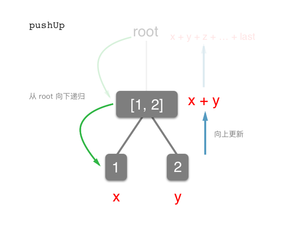
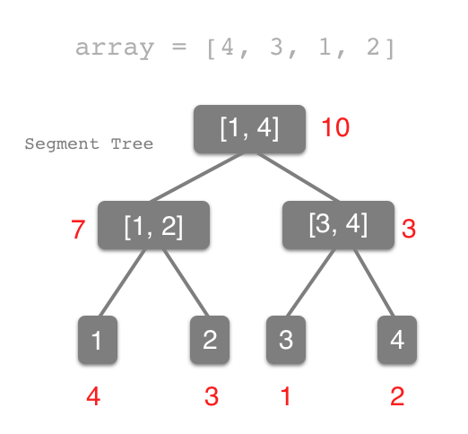
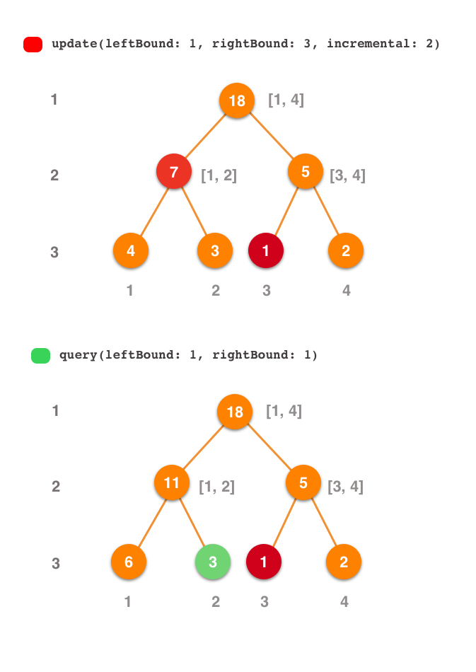
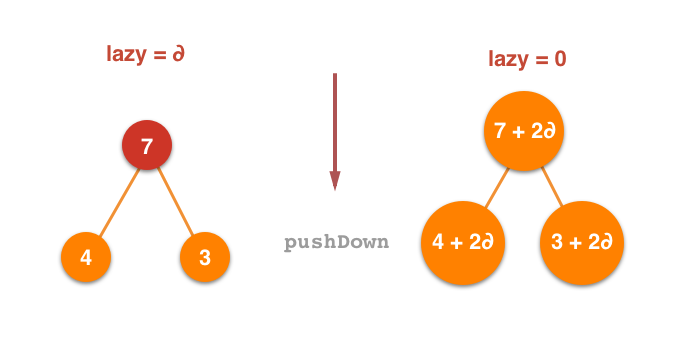

> 这篇文章是向 **Ray Wenderlich** 中 **Swift Algorithm Club** 的投稿文。用来讲述 `Segment Tree` 的区间更新操作以及 Swift 实现方案。**[Open Issue #591](https://github.com/raywenderlich/swift-algorithm-club/issues/591)**

在原始的实现中，**Artur Antonov** 利用 Swift 中很优雅的泛型`<T>`方式来对 Segment Tree 这个数据结构进行了实现。并且在这个实现中可以对其传递一个 `function: (T, T) -> T` 来反映两个叶子节点对父节点的影响。并且泛型的优势体现在可以用 Segment Tree 来解决字符串的问题，就像 Playground 中最后的这个例子：

 
stringSegmentTree.replaceItem(at: 0, withItem: "I")
stringSegmentTree.replaceItem(at: 1, withItem: " like")
stringSegmentTree.replaceItem(at: 2, withItem: " algorithms")
stringSegmentTree.replaceItem(at: 3, withItem: " and")
stringSegmentTree.replaceItem(at: 4, withItem: " swift")
stringSegmentTree.replaceItem(at: 5, withItem: "!")

print(stringSegmentTree.query(leftBound: 0, rightBound: 5))

// "I like algorithms and swift!"


`<T>` 这种方式固然有趣，可以利用 Segment Tree 来做字符串处理的地方真的少之又少。况且此数据结构的出现源自于*区间性处理问题*，将一维集合通过分制思想多线段划分，从而以空间换时间达到高效操作的数据结构。而最常见的问题即为解决区间内任意子区间求和的问题。从原本 `O(n)` 时间复杂度以二分查询的形式降低为 `O(logn)`，达到高效查询。

## pushUp 向下递归，向上更新操作

我们可以参考一下 **Artur Antonov** 的实现方法，其中有建树、单点更新和区间查询三种操作。这里将 Segment Tree 的建树操作和单点更新拿出来看一下：


public init(array: [T], leftBound: Int, rightBound: Int, function: @escaping (T, T) -> T) {
	self.leftBound = leftBound
	self.rightBound = rightBound
	self.function = function
	// ①
	if leftBound == rightBound {
		value = array[leftBound]
	} 
	// ②
	else {
		let middle = (leftBound + rightBound) / 2
		leftChild = SegmentTree<T>(array: array, leftBound: leftBound, rightBound: middle, function: function)
		rightChild = SegmentTree<T>(array: array, leftBound: middle+1, rightBound: rightBound, function: function)
		value = function(leftChild!.value, rightChild!.value)
	}
}



在 ① 位置中，当遍历节点的左边极限范围和右边极限范围相同时，则说明这是一个叶子节点，则直接为其赋值即可。而 ② 位置说明该节点为父节点（仅对于有无子节点而言）时，需要对下层叶子继续构建，在后续的递归过程时对该节点进行构建。

继而，我们来看单点更新(Query)的操作：


public func query(leftBound: Int, rightBound: Int) -> T {
	if self.leftBound == leftBound && self.rightBound == rightBound {
		return self.value
	}

	guard let leftChild = leftChild else { fatalError("leftChild should not be nil") }
	guard let rightChild = rightChild else { fatalError("rightChild should not be nil") }

	// ①
	if leftChild.rightBound < leftBound {
		return rightChild.query(leftBound: leftBound, rightBound: rightBound)
	} 
	// ②
	else if rightChild.leftBound > rightBound {
		return leftChild.query(leftBound: leftBound, rightBound: rightBound)
	}
	// ③ 
	else {
		let leftResult = leftChild.query(leftBound: leftBound, rightBound: leftChild.rightBound)
		let rightResult = rightChild.query(leftBound:rightChild.leftBound, rightBound: rightBound)
		return function(leftResult, rightResult)
	}
}


在 ① 位置中是查询位置的左边界在当前节点的右边界，这时候说明击中范围偏右，需要继续向右递归查询。② 位置的情况和 ① 的情况相反，继续想左递归查询即可。而 ③ 中的代码说明当前位置为需查询位置，则继续向下递归查询，直到为单值或是恰好卡中区间即可返回结果。

从上述两个代码中，我们发现这么一个共有的部分，就是**向下递归，向上更新**部分。其实，我们完全可以将这个向下更新的操作分离处理，当需要的时候调用即可。以下是 `func pushUp(lson: LazySegmentTree, rson: LazySegmentTree)` 操作：


// MARK: - Push Up Operation
// Description: 这里是 push up 操作，用来对 Segment Tree 向上更新
private func pushUp(lson: LazySegmentTree, rson: LazySegmentTree) {
    self.value = lson.value + rson.value
}


以上代码中，仅仅对 `SumSegmentTree` 进行了实现，即求和线段树。有了这个方法，我们队构建和单点替换操作就可以直接调用实现。示例代码如下：


public init(array: [Int], leftBound: Int, rightBound: Int) {
    self.leftBound = leftBound
    self.rightBound = rightBound
    self.value = 0
    self.lazyValue = 0
    
    if leftBound == rightBound {
        value = array[leftBound]
        return
    }
    
    let middle = (leftBound + rightBound) / 2
    leftChild = LazySegmentTree(array: array, leftBound: leftBound, rightBound: middle)
    rightChild = LazySegmentTree(array: array, leftBound: middle + 1, rightBound: rightBound)
    pushUp(lson: leftChild!, rson: rightChild!)
}

// MARK: - One Item Update
public func update(index: Int, newValue: Int) {
    if self.leftBound == self.rightBound {
        self.value = newValue
        return
    }
    guard let leftChild  = leftChild  else { fatalError("leftChild should not be nil") }
    guard let rightChild = rightChild else { fatalError("rightChild should not be nil") }
    
    let middle = (self.leftBound + self.rightBound) / 2
    
    if index <= middle { leftChild.update(index: index, newValue: newValue) }
    else { rightChild.update(index: index, newValue: newValue) }
    pushUp(lson: leftChild, rson: rightChild)
}


## 从 pushDown 操作到使用 Lazy 思想对区间进行更新

上文中对于 `pushUp` 操作也许你会觉得其实没有多少变化。其实是为了引入接下来要说的 `pushDown`，进行相对而言的。

但是我想先来聊聊区间操作。所谓区间操作就是对集合中连续的一系列数据进行更新操作。在 **Artur Antonov** 的代码中，并没有实现这个操作，但是我们可以直接想到，通过一个 `for` 循环就可完成对于一个区间进行更新：


// Sample: 对集合下标 [2, 5] 的数据进行更新
for index in 2 ... 5 {
    sumSegmentTree.update(index: index, incremental: 3)
}


可是这要就会存在一个 `O(n)` 复杂度的遍历，最后使得区间更新操作的时间复杂度为 `O(nlogn)`。那么有没有一种方法，将其优化至 `O(logn)`，从而使其和单点更新以及范围查询两个操作一样优美呢？

考虑这个问题，我们需要重新来审视线段树的这个结构：

而在代码中，我们只能拿到这棵线段树的根节点。如果我们想深入到底层，然后再对树从最底层的叶子节点进行 `pushUp` 向上更新这样就能完成当前目标了，这样就要求先对这棵二叉树进行一次遍历。但一次遍历可不是易事，无论是先序还是后序，无论 DFS 还是 BFS，找到每个叶子节点一定是需要 `O(n)` 的复杂度，这已经超出了我们的期望。

所以我们开始考虑 `pushDown` 向下更新这种新操作，我们**在大范围的父内对数据进行更新，然后再向下递归时，根据更新要求，再对叶子节点进行更新**就好了。但是，这好像与 `pushUp` 没有什么改善，整棵树更新完也需要 `O(n)` 的复杂度。继续思考，当我们做范围查询操作时，也是从根节点开始，向下去卡区间范围进行递归查询。既然查询和更新的方向是一致的，我们就可以带着更新来查询了不是吗？😁 举个例子：

`update` 操作是为了让下标为 1 到 3 这三个元素的值加 2，所以我们在 2 层的第一个节点和 3 层第三个节点中加入 lazy 标记，代表这些节点需要更新，并在这个过程中，由于我们无需在 root 节点增加标记，所以在递归之前执行一次 `pushDown` 操作来更新 root 节点的值。

`query` 操作时为了查询第一个元素，我们逐层递归遍历，当来到 2 层第一个节点的时候发现，这个节点 lazy 标记不为空，所以更新一下它的值，来到 3 层第一个节点时也相同，更新之后查出结果。

是的，这就是 **Lazy 思想**。**当需要更新时，我们只对指定范围的父亲节点中增加一个待更新标记，说明这些范围我们需要更新。而在查询的时候，如果发现这些标记，则再对其子节点进行更新**。而这个向下更新操作就是 `pushDown` 方法。

下面我们用 `Swift` 来实现一下这个方案，其案例是对于 `SumSegmentTree` 的完整代码：


public class LazySegmentTree {
    
    private var value: Int
    
    private var leftBound: Int
    
    private var rightBound: Int
    
    private var leftChild: LazySegmentTree?
    
    private var rightChild: LazySegmentTree?
    
    // Interval Update Lazy Element
    private var lazyValue: Int
    
    // MARK: - Push Up Operation
    // Description: 这里是 push up 操作，用来对 Segment Tree 向上更新
    private func pushUp(lson: LazySegmentTree, rson: LazySegmentTree) {
        self.value = lson.value + rson.value
    }
    
    // MARK: - Push Down Operation
    // Description: 这里是 push down 操作，用来对 Segment Tree 向下更新
    // Open Interface Function: 此处应该开放方法对齐进行 Override
    private func pushDown(round: Int, lson: LazySegmentTree, rson: LazySegmentTree) {
        if lazyValue != 0 {
            lson.lazyValue += lazyValue
            rson.lazyValue += lazyValue
            lson.value += lazyValue * (round - (round >> 1))
            rson.value += lazyValue * (round >> 1)
            lazyValue = 0
        }
    }
    
    public init(array: [Int], leftBound: Int, rightBound: Int) {
        self.leftBound = leftBound
        self.rightBound = rightBound
        self.value = 0
        self.lazyValue = 0
        
        if leftBound == rightBound {
            value = array[leftBound]
            return
        }
        
        let middle = (leftBound + rightBound) / 2
        leftChild = LazySegmentTree(array: array, leftBound: leftBound, rightBound: middle)
        rightChild = LazySegmentTree(array: array, leftBound: middle + 1, rightBound: rightBound)
        pushUp(lson: leftChild!, rson: rightChild!)
        
    }
    
    public convenience init(array: [Int]) {
        self.init(array: array, leftBound: 0, rightBound: array.count - 1)
    }
    
    public func query(leftBound: Int, rightBound: Int) -> Int {
        if leftBound <= self.leftBound && self.rightBound <= rightBound {
            return value
        }
        guard let leftChild  = leftChild  else { fatalError("leftChild should not be nil") }
        guard let rightChild = rightChild else { fatalError("rightChild should not be nil") }
        
        pushDown(round: self.rightBound - self.leftBound + 1, lson: leftChild, rson: rightChild)
        
        let middle = (self.leftBound + self.rightBound) / 2
        var result: Int = 0
        
        if leftBound <= middle { result +=  leftChild.query(leftBound: leftBound, rightBound: rightBound) }
        if rightBound > middle { result += rightChild.query(leftBound: leftBound, rightBound: rightBound) }
        
        return result
    }
    
    // MARK: - One Item Update
    public func update(index: Int, incremental: Int) {
        if self.leftBound == self.rightBound {
            self.value += incremental
            return
        }
        guard let leftChild  = leftChild  else { fatalError("leftChild should not be nil") }
        guard let rightChild = rightChild else { fatalError("rightChild should not be nil") }
        
        let middle = (self.leftBound + self.rightBound) / 2
        
        if index <= middle { leftChild.update(index: index, incremental: incremental) }
        else { rightChild.update(index: index, incremental: incremental) }
        pushUp(lson: leftChild, rson: rightChild)
    }
    
    // MARK: - Interval Item Update
    public func update(leftBound: Int, rightBound: Int, incremental: Int) {
        if leftBound <= self.leftBound && self.rightBound <= rightBound {
            self.lazyValue += incremental
            self.value += incremental * (self.rightBound - self.leftBound + 1)
            return 
        }
        
        guard let leftChild = leftChild else { fatalError() }
        guard let rightChild = rightChild else { fatalError() }
        
        pushDown(round: self.rightBound - self.leftBound + 1, lson: leftChild, rson: rightChild)
        
        let middle = (self.leftBound + self.rightBound) / 2
        
        if leftBound <= middle { leftChild.update(leftBound: leftBound, rightBound: rightBound, incremental: incremental) }
        if middle < rightBound { rightChild.update(leftBound: leftBound, rightBound: rightBound, incremental: incremental) }
        
        pushUp(lson: leftChild, rson: rightChild)
    }
    
}


我们来解释一下这些代码片段：


private var lazyValue: Int


这里我们增加了一个 `lazyValue` 变量，这个变量的含义在当前数据结构中是当前节点需要的增量。因为其 `update` 操作时用来对指定元素和指定范围的所有元素进行数量的增减。`lazyValue` 的值弱不为0，则说明当前节点的 `value` 需要更新，而其真值为 `value + lazyValue * (rightBound - leftBound + 1)`。


// MARK: - Push Down Operation
// Description: 这里是 push down 操作，用来对 Segment Tree 向下更新
// Open Interface Function: 此处应该开放方法对齐进行 Override
private func pushDown(round: Int, lson: LazySegmentTree, rson: LazySegmentTree) {
    if lazyValue != 0 {
        lson.lazyValue += lazyValue
        rson.lazyValue += lazyValue
        lson.value += lazyValue * (round - (round >> 1))
        rson.value += lazyValue * (round >> 1)
        lazyValue = 0
    }
}


这块代码主要是检查当前节点是否需要更新，如果 `lazyValue` 的值不为 0，则需要向下更新一次。其更新原则就是左右范围差值算出元素个数，乘以增量算出父亲节点的增量，之后更新子节点的增量值，最后清零自身增量值。


public func query(leftBound: Int, rightBound: Int) -> Int {
    if leftBound <= self.leftBound && self.rightBound <= rightBound {
        return value
    }
    guard let leftChild  = leftChild  else { fatalError("leftChild should not be nil") }
    guard let rightChild = rightChild else { fatalError("rightChild should not be nil") }
    
    pushDown(round: self.rightBound - self.leftBound + 1, lson: leftChild, rson: rightChild)
    
    let middle = (self.leftBound + self.rightBound) / 2
    var result: Int = 0
    
    if leftBound <= middle { result +=  leftChild.query(leftBound: leftBound, rightBound: rightBound) }
    if rightBound > middle { result += rightChild.query(leftBound: leftBound, rightBound: rightBound) }
    
    return result
}


根据前文的分析，当对区间进行查询的时候，我们就调用一次 `pushDown` 来向下更新数据，以保证在递归查询之前所有的数据处于最新状态。有的读者可能有疑问，为什么这里的代码比原版的少了一个 `if else` 的判断？因为我使用的是判断中值与边界的关系，而不是边界与边界的关系。笔者认为这么判断代码会更加简洁，思路也会更加清晰。

以上便是 **lazy** 思想实现线段树的区间更新操作及思路。作为线段树的扩展，还可以通过**可持久化线段树**（也称**主席树**）对于永久化保存状态的概念，更深一步的理解 **lazy** 思想。另外，在代码实现的时候，**notonlysuccess**大牛的实例代码，可以说是线段树中最为清晰的实现方式，给出[链接](http://www.cnblogs.com/Destiny-Gem/articles/3875243.html)有兴趣可以自行学习。

## 后记

线段树在工程项目中是一科极少出现的数据结构，由于它属于区间树（Interval Tree）的（而且是一种大开销的）一种实现，所以更多的用来解决数学中的区间问题和统计问题中。在之后的完善中，还会针对于 `SumSegmentTree` 增加更多的区间（交、并、补）等操作，以及叶子节点合并、二维线段树等等更为复杂，希望大家共同学习，一起完善 **Segment Tree In Swift** 🐦。

> 文章最后求一个中译英的译者，一起向 `swift-algorithm-club` 进行 contribution。

