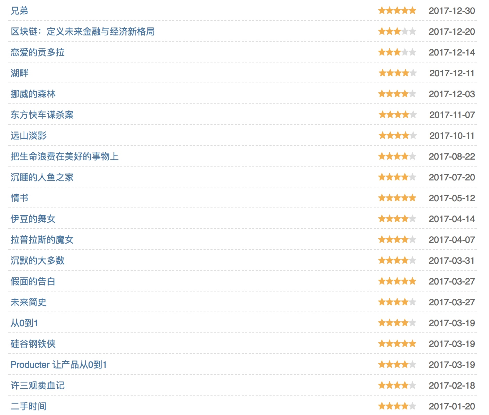
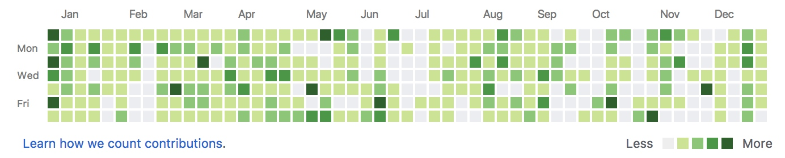
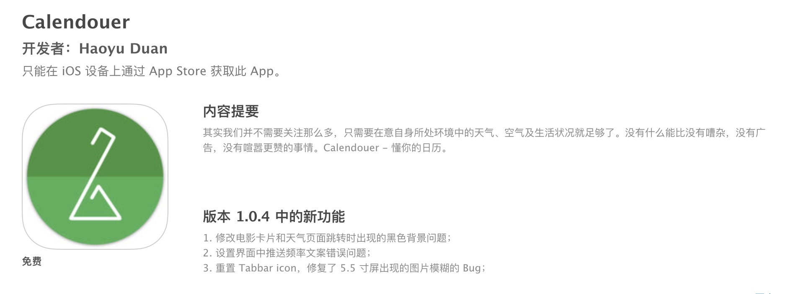
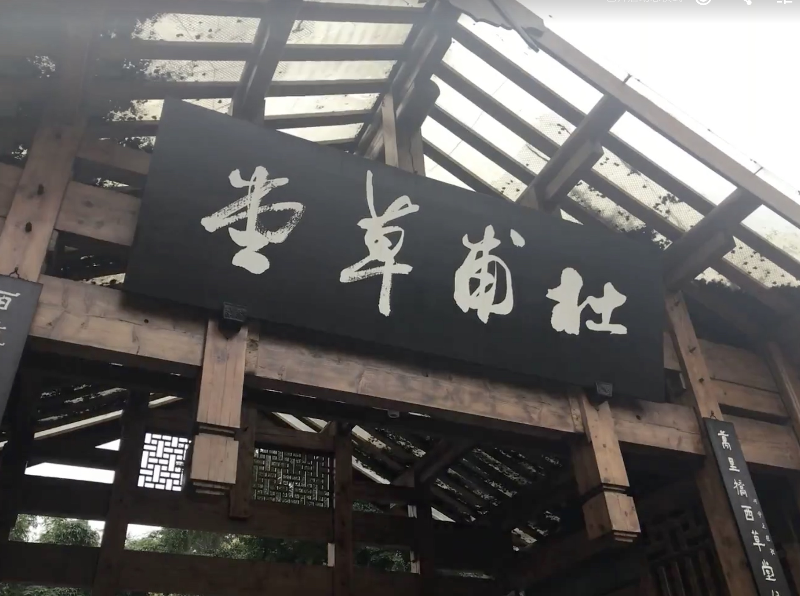
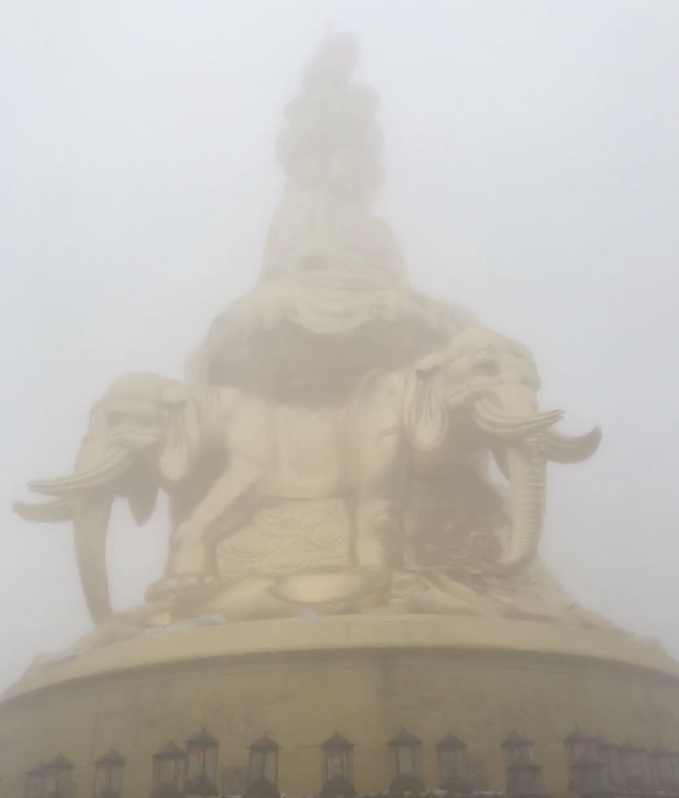
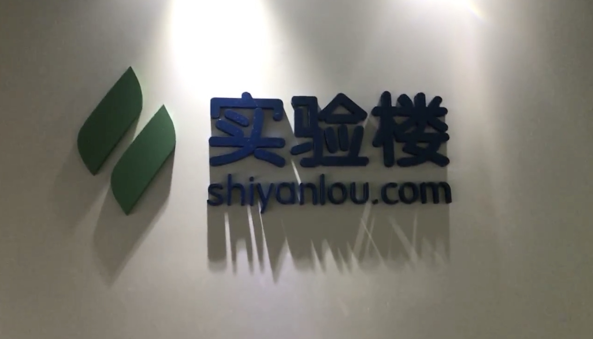
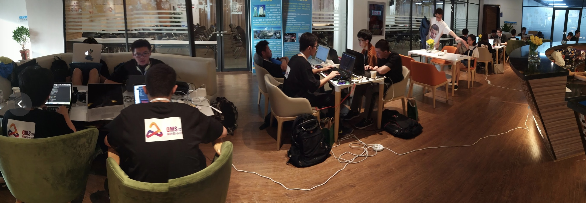
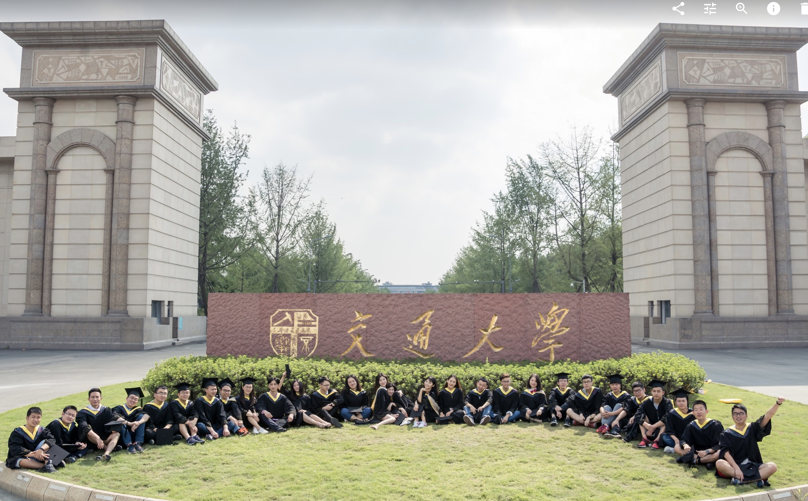
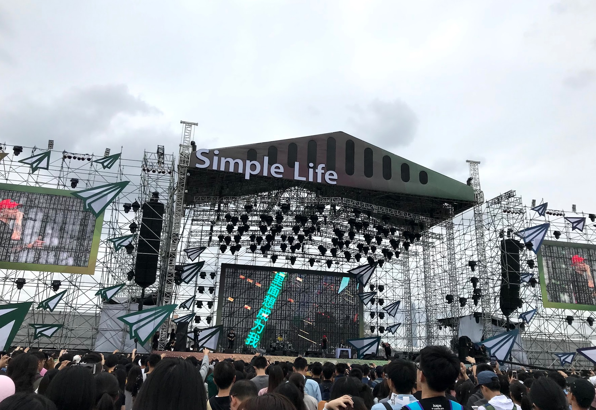
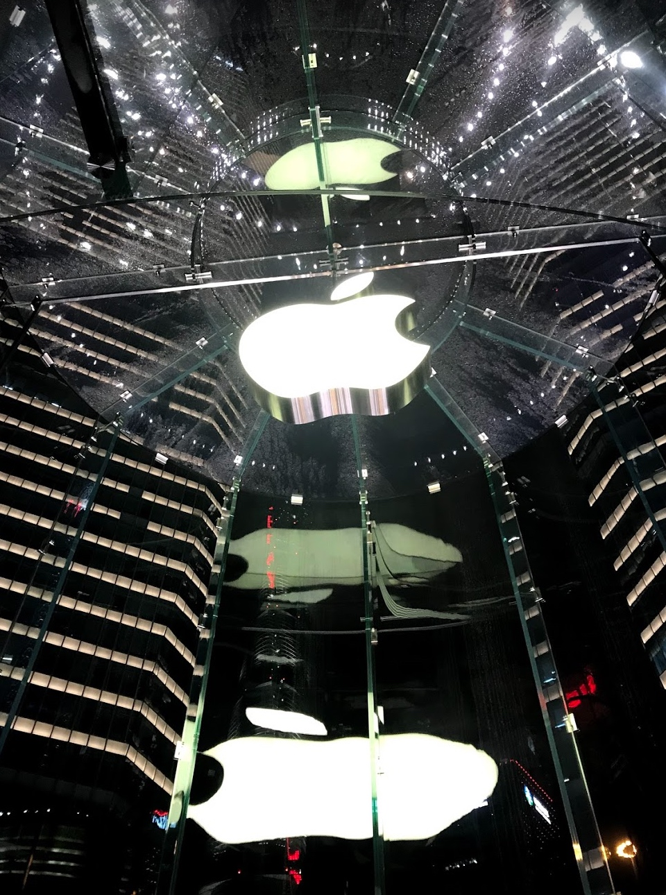

> 作者注：原本题目为《探寻属于自己的森林》，但是一想到可能有点绿(╯‵□′)╯︵┻━┻，就改成了《挪威的森林》中另外一句印象深刻的话。也许“适应黑暗”有些悲观，但是也能引申为从学生到职场员工的一种身份的转变吧。

忙忙碌碌地度过了 2017，这年一直在探求自己未来的职业方向，和探索需要学习的一些新的技术，汇总一下今年的一些成绩，也算是给自己一个交代（找点存在感）。

## 书籍阅读

年初的时候给自己定下了这么一个目标：**持续阅读，畅销书适量阅读，技术书精细挖掘**。用豆瓣记录了一年的小说、传记、杂文及设计书阅读量，共20本，其用来处理平时在交通工具上的琐碎时间：

技术书上，决定以深度为主，因为想在移动领域更上一层，要做到每一页都事件，每一段代码都理清思路。以下为技术书单以及学习情况（按照推荐度排序）：

1. **《iOS 应用逆向工程》**：用来入门逆向看的书。这本书也是收获颇多的一本，从使用 *class-dump* 、*Theos*、*Cydia* 等逆向工具，到 *Tweak* 的编写实战直至使用 *IDA* 、*LLDB* 等来分析代码行为。对于 iOS、macOS 方面有了更深的理解，顺便也入门了一下 **arm64** 汇编。
2. **《macOS软件安全与逆向分析》**：虫神的这本书简直不能再良心了，如果说 **《iOS 应用逆向工程》** 教会你如何逆向，这本书再 hack 的同时也分析了原理。其中第四章**macOS软件内幕**对于 Mach-O 的几大过程以及 dyld 过程的源码分析由浅及深。我也写了多篇博客也就是学习这本书的一些读书笔记和深入探求。
3. **《Structure and Interpretation of Computer Programs》**：即神书 SICP。阅读全书并完成了前三章的题目习题。主要了解了现代语言的设计规则，以及函数式的一些思想。练习题目主要以 *Scheme* 编写算法为主，括号调用方式真的很像 *Smalltalk* 和 *Objective-C*。
4. **《ES 6 标准入门》**：阮老师的 ES 6 标准业界权威书籍。对于阮老师的技术水平及口碑这里不做任何评论，但是这本书较为细致地介绍了 ES 6 的语法特性，其中也发觉 JS 的语法在逐渐的融入其他语言的优质特性。例如 Generator `yield` 与 Python 十分相似等。阅读该书的目的主要原因是对于 React Native 的学习。
5. **《Flask Web Development》**：Flask 开发的入门经典书籍。国内有**安道**大佬的译版，翻译的也不错。介绍了 Flask 项目结构、Jinja2 模板、*Flask-SQLAlchemy* 的操作及 *Flask-Migrate* 对于 DB 的迁移方案，最后还用了一个搭建博客的例子（感觉和 *Learning Python* 中的 Django 例子有异曲同工）来实战了一个完整的项目。
6. **《Effective Python》**：每次阅读 Effective 系列都有一种拍案叫绝的感觉。以条款的方式介绍了很多 Python 开发中的干货，印象很深的就是 **futures** 平行计算、*metaclass* 的动态语言花式操作以及 pdb 的互调调试。很多技巧在我的毕设中有所运用。
7. **《Swifter - Swift 必备 Tips》**：喵神写的书，其实只是把 Swift Programming 中的一些知识以短小精悍的 Tips 模式介绍出来，可以很轻松的阅读完一些容易遗忘的特性。收获一般。

另外还有一些二刷或多刷的书籍，比如**《Effective Objective-C》**、**《Pro Multithreading and Memory Management for iOS and OS X》**等。没事的时候翻一翻，巩固一下知识点。

## Github 个人代码量

全年 973 contributions，其中都是博客功能相关、阅读实战 Demo 等。一个开源项目 **Calendouer 豆日历** 在 6 月份完成上架，但是现在由于豆瓣 API 的限制，已经没有维护的积极性。但是也算是自己学习 Swift 的一次实战。

另外最近又恢复了 **Leetcode** 的练习，并且每周坚持参加 Weekly Contest，并及时完成补题，希望这个习惯也能一直坚持下去。

## 明年的小目标

* 熟练 Android 开发，把*第一行代码*那本书看完，自己做有个 Android 上架到 Google Play
* 完成第二个个人 App 上架。定于春节后上架一个 **Github 客户端 - Sepicat**，也是自己生活中会用的到的东西，平时喜欢读一些优质源码。
* 继续深层学习，iOS 安全及逆向、Kernel 等，继续挖掘原理。

## 博客写作

2017 年一共写了 11 篇技术博客，我认为还算是“高质量”。如果只是介绍性的写一写浅显的语法和教程，这样的文章 Google 能找出很多。以博客当做个人笔记的整理，也是自我规定的一项原则，希望这个习惯能坚持，并提高博客写作的更新频率。

| Title      |   Time | 
| :-------- | :-------- | 
| [load 方法全程跟踪](http://www.desgard.com/Load/)  | 2017-01-16  | 
| [CFArray 的历史渊源及实现原理](http://www.desgard.com/CFArray/)     | 2017-02-02  | 
| [复用的精妙 - UITableView 复用技术原理分析](http://www.desgard.com/TableView-Reuse/)      | 2017-04-16  | 
| [BannerHoverView - 解耦 TableView Header 实现悬停](http://www.desgard.com/BannerHoverView/) | 2017-05-31  |
| [SDWebImage Source Probe: Operation](http://www.desgard.com/SDWebImage4/) | 2017-06-22 |
| [Swift Probe - Optional](http://www.desgard.com/swift-optional/) | 2017-07-14 |
| [Shadowsocks Probe I - Sock5 与 EventLoop 事件分发](http://www.desgard.com/Shadowsocks-1/) | 2017-08-14 |
| [用 Lazy 思想实现 Segment Tree 的区间更新](http://www.desgard.com/lazy-segment-tree/) | 2017-08-27 |
| [Mach-O 文件格式探索](http://www.desgard.com/iosre-1/) | 2017-10-08  |
|[Shadowsocks Probe II - TCP 代理过程](http://www.desgard.com/Shadowsocks-2/)|  2017-11-12  |
| [巧用符号表 - 探求 fishhook 原理（一）](http://www.desgard.com/fishhook-1/) |  2017-12-17 |

至今为止，瓜地已经停留在 v4.0 一年之久。原本想基于 *react.js* 重写一版，但是考虑到还要租用服务器就停止了 v5.0。在 v4.0 的基础上功能始终迭代，现在已经支持 *Gitalk* 评论、百度统计对于 pv 的分析以及自动跳转到 Mobile 进行屏幕适配。之后有考虑为瓜地增加 iOS 和 Android 客户端，其接口直接使用 Gitpages 做成静态数据即可。希望能把 Jekyll 技术玩到极致，能省去一年 300+ 的服务器租用价格。

## 生活见闻 = 小作文 + 流水账

在川蜀之地渐渐适应了那里的阴潮的天气，也渐渐接受了成都的口音。以前看过有人写道：“四川话骂起人来就像成都的阴连小雨，三天三夜，绵绵无尽，语速快的针都插不进。”四年在成都的经历除了奋斗，剩下的用“巴适”形容再合适不过了。

**拍摄于 2017 年 4 月 6 日 杜甫草堂**

也许是赵雷那首歌，感觉年初的时候成都的人渐渐多了很多，但是对应的雾霾也多了很多，在城建中收获的多也损失的多。

二月过年，阳春回到锦官城后又开始了忙碌的毕设时间。聊聊草草的研究了很多沙盒以及 docker 的技术后，完善了毕设并开始撰写论文。三月四月现在想起，也是觉得浑浑噩噩，因为写论文的时光，就好似无味的消磨时间。

记得三月初和小杨去了一次峨眉。当时也算是冬天的尾巴，再加上每上升一千米气温下降六度的定理，峨眉就是一座雪山。我们在鞋上绑上钉子，开始往上爬，目标就是为了去看一眼金顶。也忘了爬了多久，到了山顶抬头一望，心里一万个草拟吗飞驰而过。看照片就好比买家秀一样。我和小杨都笑了。**也许爬峨眉是我这一年干过的最后悔的一件事**。

**拍摄于 2017 年 3 月 11 日 峨眉山·金顶**

也是三月，给自己规划好了毕设的安排后，又开始去一家创业公司 - **实验楼** 实习，一来是为了自己攒点经费买些喜欢的东西，二来是学一些新技术。他们主要是以 Web 虚拟化技术为核心的线上教学平台，也是以编程为主。我实习的内容不再做老本行移动开发，而是去搞了一段时间的 Python 后端和一些文档内容的编写。CEO 石磊是北大的硕，原来在因伟达做过虚拟化技术，后来自己创业也拿到了可观的融资。石总也是个风趣的人，很多的产品想法也是他自己想出来的，在实验楼的日子自己也学到了很多东西，尤其是对于 Python 的熟练程度。

**拍摄于 2017 年 3 月 16 日 成都软件园**

之后的每周就开始了循环，实习、写论文、玩。因为一想到来成都都第四个年头了还没有吃遍成都市着实说不过去，那么还不抓紧机会。其中在五月初收到灿海的邀请去南京打了一次 Hackathon ，不仅报销了车票，最后还拿到了季军，把机械键盘变现了还挣了点小钱，也是十分开心的。

**拍摄于 2017 年 5 月 13 日 南京**

五月底，毕业季的终章了，毕业照班级聚会。无节操的 Pose 以及酒后吹牛的各种饭局。想念那段时间和几个要好哥们一块去吃钵钵鸡、小龙虾，各种惬意。心中讲真不是很喜欢这所大学，但是突然要离开了也是很舍不得的。和 ACM 校队同学们通宵刷题、在风雷工作室各种学习和产出、HackSwjtu 各种搞破坏都成为了过去。大学生涯结束了，虽然很漫长，但是那一刻又觉得很短暂。

**拍摄于 2017 年 6 月 9 日 郫县·西南交通大学**

水深火热的毕业答辩，再到和朋友们的告别，之后是大学的毕业旅行。就这样到了七月，因入职再次来了魔都。加入奇艺，因为是原先实习组，对日常业务也是比较熟悉了，所以也没有什么开发适应期。

**上海的节奏真的要比成都快很多**，无论是路上穿正装快频的步伐，还是黄蓝外卖小哥那冲刺的背影，都让人不禁的和成都的生活做起比较。奇艺平时员工幸福感拿捏的很不错，往日里也有很多福利和 TB，业务相对来说也不是很忙（前提是适应并熟悉了当前业务流程）。

值得一提的是，在魔都会有很多技术分享，这个多是相对于成都而言的，基本上每隔2个周末就会有关于移动技术的 Topic，所以迄今为止已经去过了好几个公司参观，包括饿了么、沪江、七牛等地方。闲暇之余，还可以去听听演唱会躁一下，让往日里疲惫的身心缓解一下。在魔都的日子节奏很快，所有人也都跟打了鸡血一样，努力生活与工作，这样你也就有了努力的理由。

**拍摄于 2017 年 10 月 2 日 上海世博艺术宫·简单生活音乐节**

“每个人都有属于自己的一片森林，也许我们从来不曾去过，但它一直在那里，总会在那里。迷失的人迷失了，相逢的人会再相逢”。每个人都在于生活和机遇搏斗，换取的有钱财和幸福。学生时代的离去会让很多人怀恋和后悔，但是时间不停依旧前行。激励人们而忘掉烦恼的，终究只有家乡和梦想，也许最后的答案 Coco 早已经告诉了我们。

**拍摄于 2017 年 12 月 23 日 上海陆家嘴·Apple体验店**

> 冬瓜写于 2017.12.30 日 9 时