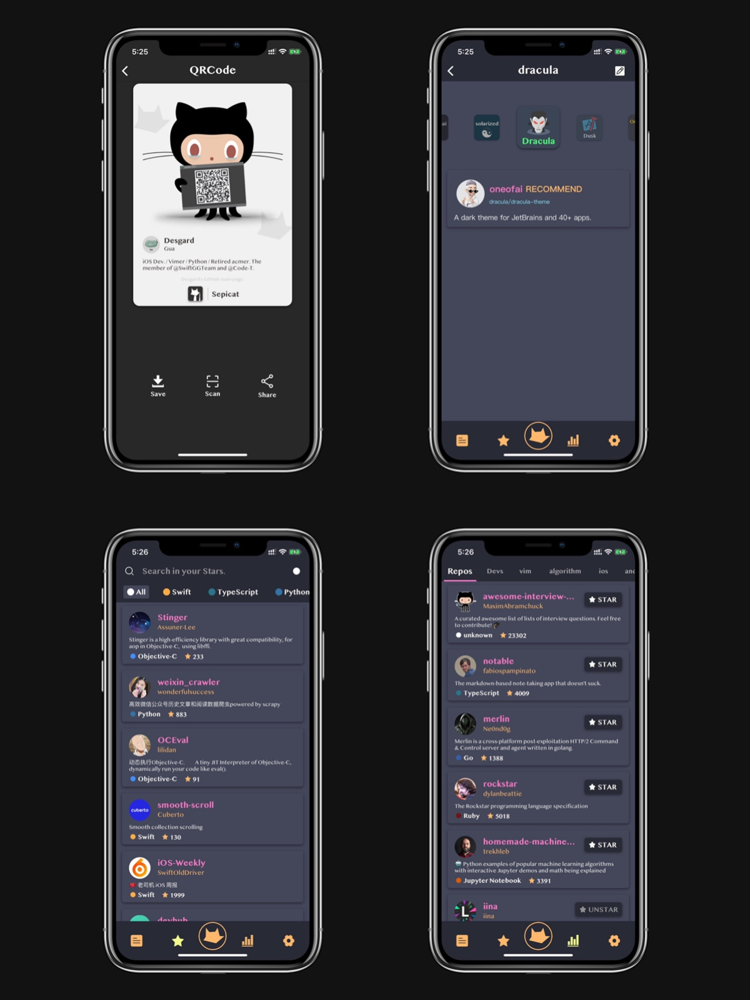
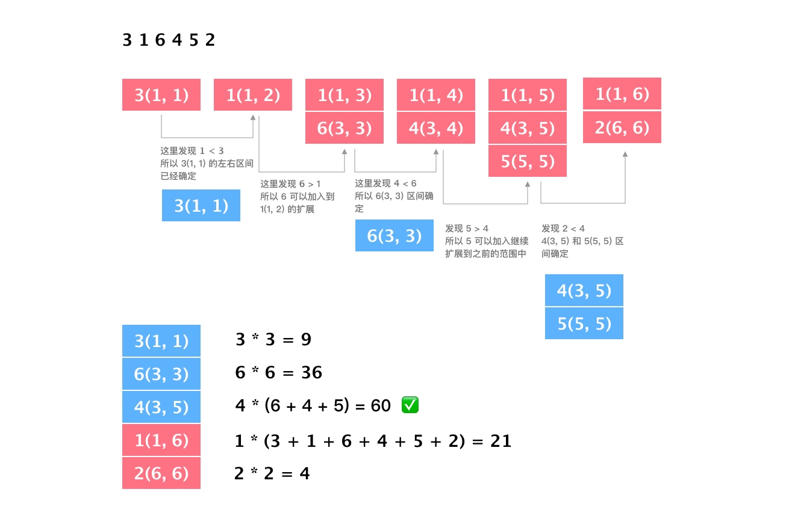

有到了写年终总结的时候，2018 年感觉自己做了很多有意思的事情，但是感觉时间仍旧不够用，就连写博客总结的时间都被剥夺了。希望 2019 年能多挤一些时间出来留给学习与总结。因为很多东西的总结是关键的，可能这是适用于自身学习的方法论。 🤣

## 积累

### 读书

翻了一下 2018 的豆瓣成绩，技术类 3 本，读物类 19 本（之前懒得记录，12月份一块记了一波豆瓣 😆），读书居然比去年少了 2 本，个人总结原因有二：

1. 上班通勤大幅度缩短，现在距离公司 800 米，每天早上的缝隙时间就变得很少；
2. 工作时长相比以前增长，并且有挑战性的事情变多，更多的时间投入到了技术的学习和代码的实现。

这里说几本比较有意思的书：

1. *《白金数据》*：东野的伦理类与科技类小说，虽然不是很精彩，但是将科技侦破与政治相结合，也反映了很多社会问题。
2. *《长夜难明》*：强烈推荐这本书，非常棒的动机推理故事。读完之后的感觉，就像之前看*《嫌疑人X的献身》*、*《恶意》*一样，直到最后才浮现真想；
3. *《腾讯传》*：不看腾讯的历史，你很难想象 QQ 做下去的艰辛创业史，面临多个强大的竞品如何保住自身的地位，如何实现 IM 软件在商业化上的成功变现。另外：QQ 秀、Qzone、各种钻对于九零后的我们太回忆杀了。另外，十分不建议看*《阿里传》*、*《蚂蚁金服》*，这两本书实在是不客观。
4. *《Ruby基础教程》*：工作需要去学这么一个语言来做工具链，所以看了看这本入门书。对新手很友好，上手很快，但是有些枯燥。最近开始看 *《Ruby元编程》*，有一定的基础要求，但是比这本有趣的多。

### GitHub 统计 

GitHub 全年贡献 420 Contributions，日均 1.14 次，与去年 GitHub 的贡献对比大打折扣。

由于年中更换了工作，适应新工作就没有像之前那么频繁。另外，**Sepicat** 在 5 月份将全部代码迁移到了 **BitBucket**，所以所有关于 Sepicat 开发的 GitHub Contribution 就全部停滞了。

### 个人 APP - Sepicat 的迭代

Sepicat 自今年 4 月份发布已经迭代至 1.2.8，其中经历了 11 个版本。在这 11 个小版本中我做了很多自己认为很帅的需求，下面展示一下我认为最炫酷的几个功能。

1. GitHub 个人 QRCode 名片；
2. Sepicat Theme 程序员信仰主题；
3. Star Box - Star 收藏盒子快速检索；
4. Trending 广场，用于发现更多有趣的 Repository；

如果你喜欢 GitHub 并且也喜欢 Sepicat 的风格，也可以来 App Store 购买支持下我。

## 全年心得

### 爱奇艺的积累

2018 年 5 月份我经历了第一次跳槽，结束了在爱奇艺 1 年多的经历。非常幸运的从 2016 年 8 月份的实习一直到校招 Offer 进入爱奇艺电视果团队，亲眼见证了电视果这个硬件从 10w/年 到 50w/年 的突破。整个团队的小伙伴也十分给力，很有创业精神。爱奇艺电视果 APP 从 3.0 迭代到 5.0 的整个过程，硬件从最简单的 DLNA 协议一直到 4G 版本可插卡功能。在 3 个人支撑日活近 10 万 App 的迭代过程中，我个人也学到了很多东西。

清明节过后，开始找第二份工作。其实刚开始决定找工作的时候有一些跟风，Joy、BS 和大左他们这些我认为在同龄人里钦佩的一些人都已经跳槽，并且其工作内容都已切换成自己认为理想的方向，所以自己也有了跳槽的打算。另外，个人也希望参与一款体量大的 APP 开发，所以想去尝试一下。经过了多方面的对比，发现头条是一个好的去处。

### 抖音的面试经历

这里我尽可能的还原一下抖音面试的全部过程，当然团队还在扩建，移动端、前端和后端都在招人。如果有兴趣也可以在下面评论或者其他方式联系我。

#### 一面

* HTTP 和 HTTPS 的区别以及 HTTPS 中的 TLS和 SSL 细节。
* SSL 中的对称加密和非对称加密。
* DLNA 的 SSDP 发现流程。
* ObjC 问题集：`NSObject` 结构；isa 指针结构；引用计数相关；block 类型、特点及循环引用注意点。
* 聊了下之前的项目经验；
* 聊了下 Sepicat 中的一些动画实现；
* ASDK 渲染大致原理；RunLoop 各个 Mode 差异；
* `SDWebImage` 中关于 Download 部分的实现；

Coding 了一道算法题：找出一个数只交换两个数字的位置，求出下一个排列数。例如：

 
// 交换了 2 和 3 的位置
`123` -> `132`

// 交换了 1 和 5 的位置
`1359727` -> `1359772`


考虑到这种情况可能不出现，例如如果是 `321` 的话，就不存在这种数。

这题乍一看和 [Leetcode31 Next Permutation](https://leetcode.com/problems/next-permutation/) 很像，但是多了一个只交换两个数字的限定。但是我们可以继续考虑 Next Permutation 的过程 - 从低位向高位查询，找到第一个字典序递减的数 `s[i] < s[j]`(`j` 在低位，`i` 在高位)，如果不存在则进行当前序列的逆序。**如果找到这个递减数对就将其交换**，当然在原题目里还会对 `j` 右边的数做降序排序，由于我们这边只需要将递减对进行交换，因为我们要保证**只交换一次**。

 
#include <iostream>
#include <vector>

using namespace std;

int next_perm(vector<int> &num) {
    if (num.size() < 2) return 0;
    int n = num.size(), j = n - 2;
    while (j >= 0 && num[j] >= num[j + 1]) j --;
    if (j < 0) {
        // 无下一个数
        return -1;
    }
    int i = j + 1;
    while (i < n && num[i] > num[j]) i ++;
    i -- ;
    swap(num[i], num[j]);
}

// Unit Test 代码
void test(int test_number) {
    int current_num = test_number;
    vector<int> num;
    while (current_num % 10) {
        int digit = current_num % 10;
        current_num /= 10;
        num.push_back(digit);
    }
    reverse(num.begin(), num.end());
    int res = next_perm(num);
    cout << "- Test Number: " << test_number << endl;
    cout << "- Result: ";
    if (res < 0) {
        cout << "No" << endl;
    } else {
        for (auto item: num) { cout << item; }
        cout << endl;
    }
}

int main() {
    //- Test Number: 123
    //- Result: 132
    test(123);
    //- Test Number: 1359727
    //- Result: 1359772
    test(1359727);
    //- Test Number: 3214
    //- Result: 3241
    test(3214);
    //- Test Number: 2434442
    //- Result: 2444432
    test(2434442);
    return 0;
}


#### 二面

* 设计一个异步加载图片换成库及其优化：这里主要讲了一遍 `SDWebImage` 的完整流程，画了整个黑板，并且说了一下可以在 Cache 部分把 `YYCache` 的思路拿过来进行优化；
* 完整讲了一遍 `fishhook` 的原理，可以详细看之前写的两篇 `fishhokk` 源码解析；
* `NSAutoreleasePool` 的原理，链表结构及自动释放原理。
* 项目经验和独立 APP 开发的目的；

Coding 了一个算法：`n` 个数，求某段区间的最小值 * 该区间所有元素之和的最大值以及这个区间。样例：

 
3 1 6 4 5 2


求得最终结果为 `60 = (6 + 4 + 5) * 4`，且这个区间是 `[6, 4, 5]`。在面试过程中，其实我没有写出这题，直到面试官在面试最后给我提示是**单调栈**，才想起来这是对单一节点扩展的经典题 🤣 。我们通过维护一个单调递减栈，保证栈顶是最大值，然后每一个节点维护一个连续区间，这个区间的目的是用来记录之后的元素向前延伸的结果。拿 Sample 举例子：

我们在这个过程中可以总结两个结论：

1. 如果新元素已经进入单调栈中，说明它的向左扩展就已经确定下来了；
2. 如果一个就元素被弹栈了，那么说明它的向右扩展就确定下来了；

**弹栈的条件就是如果新元素大于当前栈顶元素，那么就可以扩展栈内全部元素，否则在栈中找到所有小于等于这个新元素的旧结点，来扩展它的向右扩展。**

 
#include <iostream>
#include <vector>

using namespace std;

struct node {
public:
    int l, r;
    int val;
    node(int ll, int rr, int vv): l(ll), r(rr), val(vv) {};
    node max(node item, vector<int> sum);
    void prt();
};

node node::max(node item, vector<int> sum) {
    int current = (sum[this -> r + 1] - sum[this -> l]) * this -> val;
    int other = (sum[item.r + 1] - sum[item.l]) * item.val;
    if (current > other) return *this;
    else return item;
}

void node::prt() {
    cout << this -> val << " - (" << this -> l << ", " << this -> r << ")" << endl;
}

void prt(vector<node> arr, string name) {
    cout << " --- " << name << " --- " << endl;
    for (auto item: arr) {
        cout << item.val << " - (" << item.l << ", " << item.r << ")" << endl;
    }
}

void monotoic_stack(vector<int> &nums) {
    int len = nums.size();
    vector<int> sum(len + 2, 0);
    vector<node> st, res;

    // 初始化 sum 数组
    sum[1] = nums[0];
    for (int i = 1; i < len; ++ i) {
        sum[i + 1] = sum[i] + nums[i];
    }

    // 初始化单调栈
    node de = node(0, 0, nums[0]);
    st.push_back(de);

    for (int i = 1; i < len; ++ i) {
        node top = st.back();
        int l = i;
        // 出栈所有的确定右扩展的元素
        while (st.size() > 0 && top.val > nums[i]) {
            res.push_back(top);
            l = top.l;
            st.pop_back();
            top = st.back();
        }
        for (int j = 0; j < st.size(); ++ j) {
            st[j].r = i;
        }
        st.push_back(node(l, i, nums[i]));
    }

    if (st.size() > 0) {
        for (auto item: st) {
            res.push_back(item);
        }
        st.clear();
    }

    node ret = res[0];
    for (auto item: res) {
        ret = ret.max(item, sum);
    }

    ret.prt();
    cout << (sum[ret.r + 1] - sum[ret.l]) * ret.val << endl;
}

int main() {
    vector<int> test1 = {4, 3, 2, 3};
    monotoic_stack(test1);
    vector<int> test2 = {3, 1, 6, 4, 5, 2};
    monotoic_stack(test2);
    return 0;
}


#### 三面

三面就是总监面了，主要就是考察综合素质以及横向技术栈，是由前 Musical.ly 的负责人作为面试官。大概讲了一下从大学竞赛到实习再到工作的经历，讲了技术栈的横向积累。并且问了一个实际的 Case 如何实现，原意大概是如何模拟 Tweet 中缓存上次浏览的 Cell 并上拉刷新，也问了一些图片预加载、数据库 DB 如何根据这种场景来设计等问题。

#### 总结

头条的面试更多的是考察基本功和已掌握的知识是不是理解的透彻，没有奇怪的问题。但是对算法的考察力度还是相当大的，需要现场 Coding 自己去想 Corner Case，但是面试官看重的是解题的思路和过程，以及代码的熟练度，其实结果往往能通过 80% 的 Case 就好，毕竟谁都不可能每次都是领 Bug。

### 在抖音半年来的感受

**首先说头条 80% 的价值观我都十分赞同**，我非常认同这里的工程师文化，产品需求评审的时候，研发可以随时的 Challenge 产品，如果沟通觉得合理可能会给你的想法开一个 ABTest 丢到线上去做实验。所有出现的问题都先从及时止损、解决问题的角度考虑，再去思考如何优化。单周发版的超快速节奏可以将很多好玩的新功能快速上线、及时试错。就是在这种节奏下，头条系的产品才能常年霸榜，总出爆款。

在抖音我亲眼见证了抖音 DAU 从 1 亿做到 2 亿，TikTok DAU 狂飙到千万的过程。也见证了抖音 iOS 团队从 40 人到现在的 80 人。DAU 数据以及用户留存转化数据真的是一个工程师干活的动力，很有幸可以体验到这种感觉。

另外，在抖音的基础技术线，和同事一起完成了多仓效率开发的工具链 - MBox（如果是同事可以去双月刊搜下😁），并且正在构建一个组件化版本控制的平台，预计这个双月就会上线使用。通过对效率工具和调试工具的输出，也算是接触到了全栈开发工程师的日常。总的来说，**头条是一个幸福感很高、工作很有挑战的地方**。

## 2019 计划

* 要在 iOS 组件化、CI、APM 性能调优上深钻，达到高工的水平；
* Sepicat 迭代到 2.0，新增 ISSUE 查看回复功能，主打交流模块；
* 博客持续更新，今年打算写一个小专栏，方向是 iOS 组件化及方案；
* 制作一个新 APP，目前卖个关子；
* 继续输出开源社区，保持 GitHub 活跃；
* 读书；

2019 一起努力💪。

