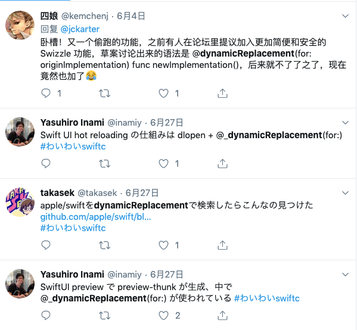
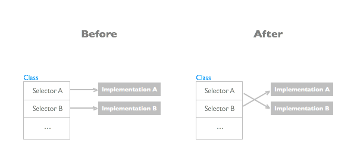
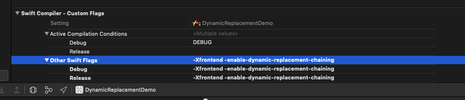
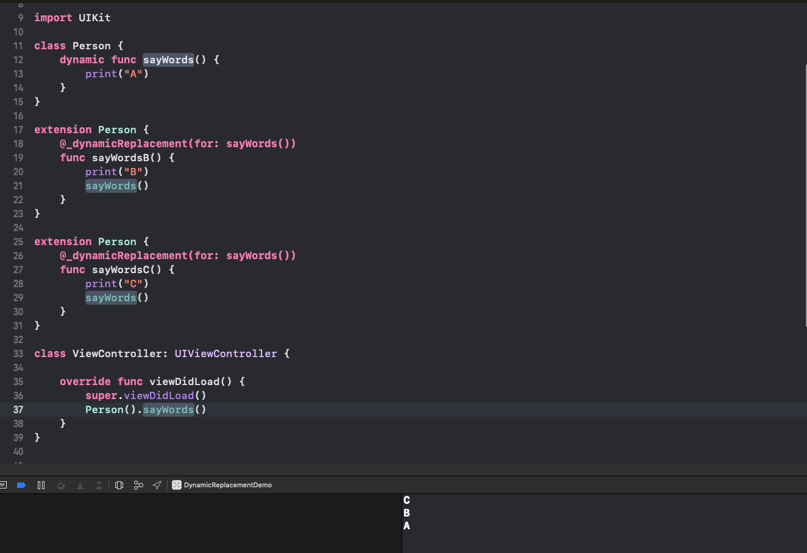

---

layout:     post
title:      Swift 5 之后 "Method Swizzling"？
date:       2019-07-28 00:00:01
author:     "Desgard_Duan"
categories:
- iOS
- Swift
tags:
- iOS
---

# Swift 5 之后 "Method Swizzling"？

## 引子

随着六月份的 WWDC 上对 SwiftUI 的发布，感觉 Swift 有变成了炽手可热的话题。在大会结束后，发现了有这么几条 Twitter 在讨论一个叫做 `@_dynamicReplacement(for:)` 的新特性。

这是一个什么东西呢，于是我在 Swift 社区中也检索了对应的关键字，看到一个 ***[Dynamic Method Replacement](https://forums.swift.org/t/dynamic-method-replacement/16619)*** 的帖子**。**在爬了多层楼之后，大概看到了使用的方式（环境是 macOS 10.14.5，Swift 版本是 5.0，注意以下 Demo 只能在工程中跑，Playground 会报 `error: Couldn't lookup symbols:` 错误）。


class Test {
    dynamic func foo() {
        print("bar")
    }
}
    
extension Test {
    @_dynamicReplacement(for: foo())
    func foo_new() {
        print("bar new")
    }
}
    
Test().foo() // bar new


看到这里是不是眼前一亮？我们期待已久的 ***Method Swizzling*** 仿佛又回来了？

开始的时候只是惊喜，但是在平时的个人开发中，其实很少会用到 hook 逻辑（当然这里说的不是公司项目）。直到有一天，同事遇到了一个问题，于是又对这个东西做了一次较为深入的研究 ....

## Method Swizzling in Objective-C

首先我们先写一段 ObjC 中 Method Swizzling 的场景：


//
//  PersonObj.m
//  MethodSwizzlingDemo
//
//  Created by Harry Duan on 2019/7/26.
//  Copyright © 2019 Harry Duan. All rights reserved.
//
    
#import "PersonObj.h"
#import <objc/runtime.h>
    
@implementation PersonObj
    
+ (void)load {
    static dispatch_once_t onceToken;
    dispatch_once(&onceToken, ^{
        Class class = [self class];
        SEL oriSelector = @selector(sayWords);
        SEL swiSelector = @selector(sayWordsB);
        Method oriMethod = class_getInstanceMethod(class, oriSelector);
        Method swiMethod = class_getInstanceMethod(class, swiSelector);
        method_exchangeImplementations(oriMethod, swiMethod);
        
        SEL swi2Selector = @selector(sayWorkdsC);
        Method swi2Method = class_getInstanceMethod(class, swi2Selector);
        method_exchangeImplementations(oriMethod, swi2Method);
    });
}
    
- (void)sayWords {
    NSLog(@"A");
}
    
- (void)sayWordsB {
    NSLog(@"B");
    [self sayWordsB];
}
    
- (void)sayWorkdsC {
    NSLog(@"C");
    [self sayWorkdsC];
}
    
@end


上述代码我们声明了 `- (void)sayWords` 方法，然后再 `+ (void)load` 过程中，使用 Method Swizzling 进行了两次 Hook。

在执行处，我们来调用一下 `- sayWords` 方法：


PersonObj *p = [PersonObj new];
[p sayWords];
    
// log
2019-07-26 16:04:49.231045+0800 MethodSwizzlingDemo[9859:689451] C
2019-07-26 16:04:49.231150+0800 MethodSwizzlingDemo[9859:689451] B
2019-07-26 16:04:49.231250+0800 MethodSwizzlingDemo[9859:689451] A


正如我们所料，结果会输出 CBA，因为 `- sayWords` 方法首先被替换成了 `- sayWordsB` ，其替换后的结果又被替换成了 `- sayWordsC` 。进而由于 Swizze 的方法都调用了原方法，所以会输出 CBA。

来复习一下 ***Method Swizzling*** 在 Runtime 中的原理，我们可以概括成一句话来描述它：**方法指针的交换**。以下是 ObjC 的 Runtime 750 版本的源码：


void method_exchangeImplementations(Method m1, Method m2)
{
    if (!m1  ||  !m2) return;
    
    mutex_locker_t lock(runtimeLock);
		
	// 重点在这里，将两个方法的实例对象 m1 和 m2 传入后做了一次啊 imp 指针的交换
    IMP m1_imp = m1->imp;
    m1->imp = m2->imp;
    m2->imp = m1_imp;
    
    
    // RR/AWZ updates are slow because class is unknown
    // Cache updates are slow because class is unknown
    // fixme build list of classes whose Methods are known externally?
    
    flushCaches(nil);
		
		// 来更新每个方法中 RR/AWZ 的 flags 信息
		// RR/AWZ = Retain Release/Allow With Zone（神奇的缩写）
    updateCustomRR_AWZ(nil, m1);
    updateCustomRR_AWZ(nil, m2);
}


由于 ObjC 对于实例方法的存储方式是以方法实例表，那么我们只要能够访问到其指定的方法实例，修改 `imp` 指针对应的指向，再对引用计数和内存开辟等于 Class 相关的信息做一次更新就实现了 Method Swizzling。

## 一个连环 Hook 的场景

上面的输出 `ABC` 场景，是我同事遇到的。在制作一个根据动态库来动态加载插件的研发工具链的时候，在主工程会开放一些接口，模拟 Ruby 的 `alias_method` 写法，这样就可以将自定义的实现注入到下层方法中，从而扩展实现。当然这种能力暴露的方案不是很好，只是一种最粗暴的插件方案实现方法。

当然我们今天要说的不是 ObjC，因为 ObjC 在 Runtime 机制上都是可以预期的。如果我们使用 Swift 5.0 中 ***Dynamic Method Replacement*** 方案在 Swift 工程中实现这种场景。


import UIKit
    
class Person {
    dynamic func sayWords() {
        print("A")
    }
}
    
extension Person {
    @_dynamicReplacement(for: sayWords())
    func sayWordsB() {
        print("B")
        sayWords()
    }
}
    
extension Person {
    @_dynamicReplacement(for: sayWords())
    func sayWordsC() {
        print("C")
        sayWords()
    }
}
    
class ViewController: UIViewController {
    
    override func viewDidLoad() {
        super.viewDidLoad()
        Person().sayWords()
    }
}


从视觉角度上来看，通过对 Swift Functions 的显式声明（有种 Swift 真香的感觉），我们完成了对于 Method Swizzling 的实现。跑一下代码，发现运行结果却不如我们的预期：


C
A


为什么结果只显示两个？我交换了一下两个 `extension` 的顺序继续尝试，其打印结果又变成了 `BA` 。于是差不多可以总结一下规律，**在执行顺序上，后声明的将会生效**。那么应该如何实现这种连环 Hook 的场景呢？从代码层面我没有想到任何办法。

## 从 Swift 源码来猜测 `@_dynamicReplacement` 实现

按照正常程序员的逻辑，如果我们在重构一个模块的代码，新的模块代码无论从功能还是效率上，都应该优于之前的方式、覆盖之前所有的逻辑场景。如果 Swift 支持这种连环修改的场景，那这个新的 Feature 放出其实是功能不完备的！于是我们开始翻看 Swift 这个 Feature 的 PR 代码，来一探 ***Dynamic Method Replacement*** 的原理。

首先来看这个 ***Dynamic Method Replacement*** 特性的 [Issue-20333](https://github.com/apple/swift/pull/20333)，作者上来就贴了两段很有意思的代码：


/// 片段一
// Module A
struct Foo {
 dynamic func bar() {}
}
// Module B
extension Foo {
  @_dynamicReplacement(for: bar())
  func barReplacement() {
    ...
    // Calls previously active implementation of bar()
    bar()
  }
}
    
/// 片段二
dynamic_replacement_scope AGroupOfReplacements {
   extension Foo {
     func replacedFunc() {}
   }
   extension AnotherType {
     func replacedFunc() {}
   }
}
    
AGroupOfReplacements.enable()
...
AGroupOfReplacements.disable()


大概意思就是，他希望这种动态替换的特性，通过一些关键字标记和内部标记，兼容动态替换和启用开关。既然他们有规划 `enable` 和 `disable` 这两个方法来控制启用，那么就来检索它们的实现。

通过关键字搜索，我在 `MetadataLookup.cpp` [这个文件的 L1523-L1536](https://github.com/aschwaighofer/swift/blob/fff13330d545b914d069aad0ef9fab2b4456cbdd/stdlib/public/runtime/MetadataLookup.cpp#L1523-L1563) 中找到了 `enable` 和 `disable` 两个方法的实现源码：


// Metadata.h#L4390-L4394:
// https://github.com/apple/swift/blob/659c49766be5e5cfa850713f43acc4a86f347fd8/include/swift/ABI/Metadata.h#L4390-L4394
    
/// dynamic replacement functions 的链表实现
/// 只有一个 next 指针和 imp 指针
struct DynamicReplacementChainEntry {
  void *implementationFunction;
  DynamicReplacementChainEntry *next;
};
    
// MetadataLookup.cpp#L1523-L1563
// https://github.com/aschwaighofer/swift/blob/fff13330d545b914d069aad0ef9fab2b4456cbdd/stdlib/public/runtime/MetadataLookup.cpp#L1523-L1563
void DynamicReplacementDescriptor::enableReplacement() const {
	// 拿到根节点
  auto *chainRoot = const_cast<DynamicReplacementChainEntry *>(
      replacedFunctionKey->root.get());
    
  // 通过遍历链表来保证这个方法是 enabled 的
  for (auto *curr = chainRoot; curr != nullptr; curr = curr->next) {
    if (curr == chainEntry.get()) {
			// 如果在 Replacement 链中发现了这个方法，说明已经 enable，中断操作
      swift::swift_abortDynamicReplacementEnabling();
    }
  }
    
  // 将 Root 节点的 imp 保存到 current，并将 current 头插
  auto *currentEntry =
      const_cast<DynamicReplacementChainEntry *>(chainEntry.get());
  currentEntry->implementationFunction = chainRoot->implementationFunction;
  currentEntry->next = chainRoot->next;
    
  // Root 继续进行头插操作
  chainRoot->next = chainEntry.get();
	// Root 的 imp 换成了 replacement 实现
  chainRoot->implementationFunction = replacementFunction.get();
}
    
// 同理 disable 做逆操作
void DynamicReplacementDescriptor::disableReplacement() const {
  const auto *chainRoot = replacedFunctionKey->root.get();
  auto *thisEntry =
      const_cast<DynamicReplacementChainEntry *>(chainEntry.get());
    
  // Find the entry previous to this one.
  auto *prev = chainRoot;
  while (prev && prev->next != thisEntry)
    prev = prev->next;
  if (!prev) {
    swift::swift_abortDynamicReplacementDisabling();
    return;
  }
    
  // Unlink this entry.
  auto *previous = const_cast<DynamicReplacementChainEntry *>(prev);
  previous->next = thisEntry->next;
  previous->implementationFunction = thisEntry->implementationFunction;
}


我们发现 Swift 中处理每一个 `dynamic` 方法，会为其建立一个 `dynamicReplacement` 链表来记录实现记录。那么也就是说不管我们对原来的 `dynamic` 做了多少次 `@_dynamicReplacement` ，其实现原则上都会被记录下来。但是调用方法后的执行代码我始终没有找到对应的逻辑，所以无法判断 Swift 在调用时机做了哪些事情。

## 通过 Unit Test 解决问题

以下思路是同事 [@Whirlwind](https://github.com/Whirlwind) 提供的。既然我们无法找到调用的实现，那么另辟蹊径：**既然 Swift 已经通过链式记录了所有的实现，那么在单元测试的时候应该会有这种逻辑测试。**

在根据关键字和文件后缀搜索了大量的单元测试文件后，我们发现了这个文件 [`dynamic_replacement_chaining.swift`](https://github.com/apple/swift/blob/master/test/Interpreter/dynamic_replacement_chaining.swift) 。我们注意到 [L13](https://github.com/apple/swift/blob/master/test/Interpreter/dynamic_replacement_chaining.swift#L13) 的执行命令：


// RUN: %target-build-swift-dylib(%t/%target-library-name(B)) -I%t -L%t -lA %target-rpath(%t) -module-name B -emit-module -emit-module-path %t -swift-version 5 %S/Inputs/dynamic_replacement_chaining_B.swift -Xfrontend -enable-dynamic-replacement-chaining


在命令参数中增加了 `-Xfrontend -enable-dynamic-replacement-chaining` ，第一反应：这个东西像 ***Build Settings*** 中的 Flags。翻看了 ***Build Settings*** 中所有的 Compile Flags，将其尝试写入 `Other Swift Flags` 中：

重新编译运行，发现了一个神奇的结果：

出乎意料的达到了我们想要的结果。说明我们的实验和猜想是正确的，**Swift 在处理 `dynamic` 是将所有实现的 `imp` 保存，并且也有办法根据记录的链表来触发实现**。

## 一些不怀好意的揣测

`@_dynamicReplacement` 虽然在 Swift 5 中就已经带入了 Swift 中，但是在官方论坛和官方仓库中并未找到 Release 日志痕迹，而我是从 Twitter 友的口头才了解到的。并且这个 PR 虽然已经开了一年之久，苹果在今年的 WWDC 之前就偷偷的 Merge 到了 `master` 分支上。

**不得不猜，Apple 是为了实现 SwiftUI，而专门定制的 Feature。**另外，在其他的一些特性中也能看到这种现象，例如 ***Function Builder***（为了实现 SwiftUI 的 DSL）*，**Combine***（为了实现 SwiftUI 中的 Dataflow & Binding）也是如此。这种反社区未经同意的情况下，为了自己的技术产品而定制语言是一件好事吗？

这里脑补一个黑人问号，也许明年的我会说出“真香”！