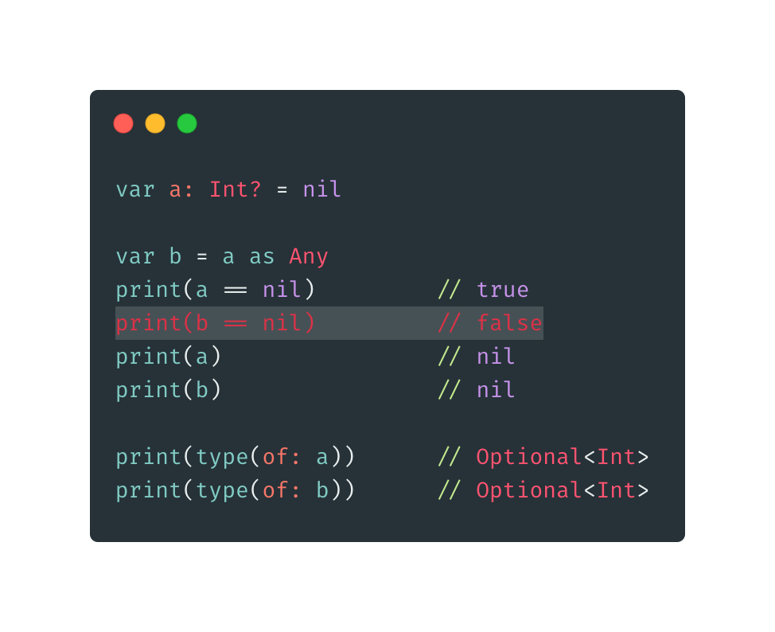
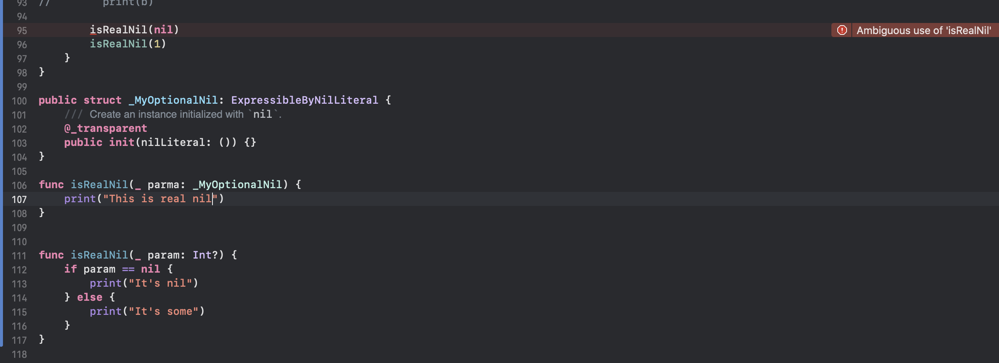

---

layout:     post
title:      模糊的 Any 和 Optional
date:       2019-12-26 00:00:01
author:     "Desgard_Duan"
categories:
- iOS
- Swift
tags:
- iOS
---

# 引出问题

`Any` 这个东西曾经在喵神的 [《Swifter Tips》](https://swifter.tips/any-anyobject/)中被称作 Swift 中的妥协的产物，是一个十分迷惑的概念。这个概念被提出是为了弥补 `AnyObject` 在 Swift 中的不足，即 `struct` 和 `enum` 等非 `class` 的类型。实时证明，`Any` 的大量使用确实会让你在开发中十分的痛苦，这个痛苦会转化成一篇博客。是的，这篇博客就是这样。🌚

我们可以先在 Playground 中尝试以下代码观察现象：

在图中我高亮了一行，也是表现最为奇怪的一行。`print(b == nil)` 输出了 `false` 。但是根据我们的认知，`b == nil` 应该返回 `true` 。因为当我们直接输出 `a` 和 `b` 的时候，其结果都是 `nil` 。

我们注意到这里的 `b` 和 `a` 唯一的区别就是，在赋值时使用了 `as Any` 将 `b` 声明成 `Any` 类型。这个声明会带来什么影响呢？

# 追溯 `==` 源码

由于我们的 `a` 变量是 `Optional<int>` 类型，所以我们要追溯到 Optional 的源码位置。在 Swift 的官方 [GitHub 代码仓库](https://github.com/apple/swift) 中找到了[定义 `==` 符号运算的实现](https://github.com/apple/swift/blob/da61cc8cdf7aa2bfb3ab03200c52c4d371dc6751/stdlib/public/core/Optional.swift#L504-L512)。


@_transparent
public static func ==(lhs: Wrapped?, rhs: _OptionalNilComparisonType) -> Bool {
  switch lhs {
  case .some:
    return false
  case .none:
    return true
  }
}


这里我们要学习两个概念：`Wrapped` 和 `_OptionalNilComparisonType` 。

## `_OptionalNilComparisonType` 和 `ExpressibleByNilLiteral`

首先再追溯一下 `_OptionalNilComparisonType` 的代码：


@frozen
public struct _OptionalNilComparisonType: ExpressibleByNilLiteral {
  /// Create an instance initialized with `nil`.
  @_transparent
  public init(nilLiteral: ()) {}
}


发现这个东西是继承于 `ExpressibleByNilLiteral` 这个协议的，这到底是一个什么东西？我们知道协议往往都是希望让某一类 `class` 或者 `struct` 具有某种功能（实现某组方法）。`**ExpressibleByNilLiteral` 协议的效果就是遵循其的类型可以使用 `nil` 字面量来初始化。\*\*在我们的代码，甚至是 Swift 官方源码中，其实也很少用到这个协议，因为有 `Optional` 的存在，往往就可以表示值可能会不存在。

> 这里延伸一些 `Attribute` 的知识，上述代码中的 `@frozen` 意思是对应的 `struct` 保证其实例不会更改，从而编译器在编译这个 `struct` 的时候会做消除冗余负载优化。而 `@_transparent` 是为了告诉编译器在需要的时候可以将声明的函数内联，即使在 `-Onone` 下也是如此。

另外我们需要知道的是，`nil` 不是一个类型，我们必须要用一个继承于 `ExpressibleByNilLiteral` 的结构体来描述这个参数。

下面我们来做一个实验：


public struct _MyOptionalNil: ExpressibleByNilLiteral {
    /// Create an instance initialized with `nil`.
    @_transparent
    public init(nilLiteral: ()) {}
}

func isRealNil(_ param: _MyOptionalNil) {
    print("This is real nil")
}

class ViewController: UIViewController {
    override func viewDidLoad() {
        super.viewDidLoad()
        isRealNil(nil) // "This is real nil"
    }
}


我们发现 `nil` 是可以走 `isRealNil` 方法的。这样可以让 `isRealNil` 显示传入 `nil` 参数。那么如果我们增加一个 `Optional` 的同名方法，会怎样呢？

此时的推断是具有二义性的，所以在调用侧是不合法的。

由此我们得知，在 `Optional` 源码中的定义内部 `_OptionalNilComparisonType` 是为了接收一个显式 `nil` 参数，从而对其进行特殊处理。

## `Optional` 多层嵌套问题

这也是一个使用 Swife 老生常谈的问题。在多层的 `Optional` 的关系中往往会让你的代码编写造成各种各样的问题。

在很久以前唐巧老师的博客 [Swift 烧脑体操（一） - Optional 的嵌套](https://blog.devtang.com/2016/02/27/swift-gym-1-nested-optional/) 中会有这个例子：


let a: Int? = nil
let b: Int?? = a
let c: Int??? = b
let d: Int??? = nil
if let _ = b {
    print("b is not none") // 会输出
}
if let _ = c {
    print("c is not none") // 会输出
}
if let _ = d {
    print("d is not none") // 不会输出
}


为什么会造成这种原因呢，其实上述那篇文章中已经给出了答案。当我们对 `Optional` 变量进行赋值的时候，会有以下的语句：


var a: Int?? = b


如果当 `b` 的类型是 `Optional<Int>` 的时候，此时 `a` 的类型 `Optional<Optional<Int>>` 与 `b` 的类型不相符，那么应该无法编译过才对。其实此处的原因也藏在 `Optional` 源码当中：


public enum Optional<Wrapped>: ExpressibleByNilLiteral { /
  case none
  case some(Wrapped)

  @_transparent
  public init(_ some: Wrapped) { self = .some(some) } // 重点二
	...
	@_transparent
  public init(nilLiteral: ()) { // 重点一
    self = .none
  }
}


重点一：当传入值右边是一个 `Wrapped` 类型，即一个泛型的时候，构造函数会将这个传入参数编程 `.some` 中的 Value ，在最外层再包裹一层 `Optional` 。

重点二：我们要知道 `Optional` 是遵循 `ExpressibleByNilLiteral` 协议的，所以当赋值符 `=` 右边是 `nil` 的时候，则最上层 `Optional` 直接被赋值为 `Optional.none` 。

我们带着这样的理解来看上述的例子：


let a: Int? = nil   // a => Optional<Int>.none
let b: Int?? = a    // b => Optional<Optional<Int>.none>.some
let c: Int??? = b   // c => Optional<Optional<Optional<Int>.none>.some>.some
let d: Int??? = nil // d => Optional<Optional<Optional<Int>.some>.some>.none


而解包操作只对最外层的 `Optional` 进行拆解，是 `.some` 则拆解成功，是 `.none` 即无法拆解。如此道理就说得通了。

# 问题回归


var a: Int? = nil
var b = a as Any
print(a == nil) // true
print(b == nil) // false 要点


这里的要点部分我们要如何解释？其实上面 `==` 的源码已经给出了答案：


b == nil

// 此处 b 在推断的时候，被当作一个 Optional<Any>.some 的类型，所以自然当作了一个 Wrapped? 来处理
// 当最外层第一次解包后，发现是一个 Wrapped 是 Any 的 .some，自然的认为不是 .none 也就不是 nil

@_transparent
public static func ==(lhs: Wrapped?, rhs: _OptionalNilComparisonType) -> Bool {
  switch lhs {
  case .some:
    return false
  case .none:
    return true
  }
}


**源码部分的判断认为，传入的 `Wrapped?` 类型，如果在解包后是 `.some` 则不是 `nil`** 。但是我们考虑一下，这真的是对的吗？

我的想法是，至少在我们这些语言使用方（iOS 的开发者）的角度来看，**这是错的**！因为我们想比较的是一个 `Optional` 的值，是不是 `nil` ，而并不关注这个 `Optional` 最外层的枚举是不是 `.some` 。从这个角度上来看，这是不友好的一面。

归根结底，这都是由于 `Nested Optionals` 这种设计而导致的。在 Swift 的官方论坛上，也有很多对于关于此问题的讨论，例如 [Challenge: Flattening nested optionals](https://forums.swift.org/t/challenge-flattening-nested-optionals/24083/3) 其中就有一些很有趣的解决方案：

我们可以通过以下这种递归的方式来解决 `Nested Optionals` 的问题：


private protocol _OptionalProtocol {
    var _deepUnwrapped: Any? { get }
}

extension Optional: _OptionalProtocol {
    fileprivate var _deepUnwrapped: Any? {
        if let wrapped = self { return deepUnwrap(wrapped) }
        return nil
    }
}

func deepUnwrap(_ any: Any) -> Any? {
    if let optional = any as? _OptionalProtocol {
        return optional._deepUnwrapped
    }
    return any
}

deepUnwrap(1)                                                       // 1
deepUnwrap(Optional<Int>.none)                                      // nil
deepUnwrap(Optional<Int>.some(1))                                   // 1
deepUnwrap(Optional<Optional<Int>>.none)                            // nil
deepUnwrap(Optional<Optional<Int>>.some(Optional<Int>.none))        // nil
deepUnwrap(Optional<Optional<Int>>.some(Optional<Int>.some(1)))     // 1


Swift 论坛中关于提出解决方案的开发者还有很多，但是大家的思路几乎都是一致的，是希望将嵌套 `Optional` 这种形式通过编码的方式处理掉，从而避免一些不必要的问题。

# 回归业务逻辑

也许你会质疑，上述的问题在开发中根本不常用，怎么可能会出现 `var b = a as Any` 这种情况？

其实这个场景是我在接手的项目中发现的一个产生 Bug 的原因，我只是抽象了一下对应的场景最简表达。在实际当中遇到的问题大概如下：


let a: Int = 0
let b: String = ""
let c: Int? = nil
let arr: [Any] = [a, b, c]

arr.compactMap { $0 }            // [0, "", nil]
arr.compactMap{ deepUnwrap($0) } // [0, ""]


我有一个数组，由于数组当中的元素在初始化的时候会含有多个类型，其中很自然的可能会出现有 `Int` 有 `String` 有 `Optional` 的问题。所以数组 `x` 自然而然变成了 `[Any]` 。当我在某些情况下，对这个数组进行过滤 `nil` 的时候，就自然过滤不掉了。也许你会说，代码为何会这么设计？虽然我也认为很多设计的不合理，但是 `nil` 的这个问题为我接手项目的排查也增加了很大的难度！😭

# 最后对于 `==` 的一点小思考

其实笔者也考虑过，如果对 `Optional` 的 `==` 逻辑进行改写从而达到判断最深层的 `value` 是不是 `nil` 这种效果。受到了上述 Swift 论坛中的影响，其实是可以使用递归的方式来解决这个问题。

以下我写了一个 Demo 来说明：


extension Optional {
    // 这是对 Optional 的一个扩展
    public struct _MyOptionalNil: ExpressibleByNilLiteral {
        @_transparent
        public init(nilLiteral: ()) {}
    }

    typealias OptionAny = Optional<Any>

    /// 重写一个 === 的操作，来递归判断 Nested Optionals 最深层是否是 nil
    public static func ===(lhs: Wrapped?, rhs: _MyOptionalNil) -> Bool {
        switch lhs {
        case let .some(innerOptionalWrappedValue):
            // 将 some 中的 value 取出，来判断 Any 的情况
            if case let OptionAny.some(innerWrappedValue) = innerOptionalWrappedValue as Optional<Any> {
                // 解包后如果是 .none，则就是 nil
                if case OptionAny.none = innerWrappedValue {
                    return true
                }
                // 如果不是 Optional<Any>.noen 则我们需要递归继续处理更深一层
                return innerWrappedValue === rhs
            }
            return false
        case .none:
            return true
        }
    }
}

let a: Int? = nil
let b = a as Any
print(b === nil) // true


当然，上述实现可能会有很多 Corner Case 没有考虑到，只是笔者的一个 Demo，但是也可以解决 `Optional<Any>.some` 当 Value 为 `nil` 时的一些值判断不符合预期的问题。

这个问题也让我更加加深了对于 Swift `Optional` 的认识。如果文中仍旧有纰漏也欢迎斧正！Swift 作为一个官方推广的强大语言，演化的语言复杂度越来越高，所以对基础的认识也要愈发深入和了解，才有能力把握这个技术！

最后的最后，感谢 Swift 大牛 [@四娘](https://twitter.com/kemchenj) 为我解答了很多疑问！
