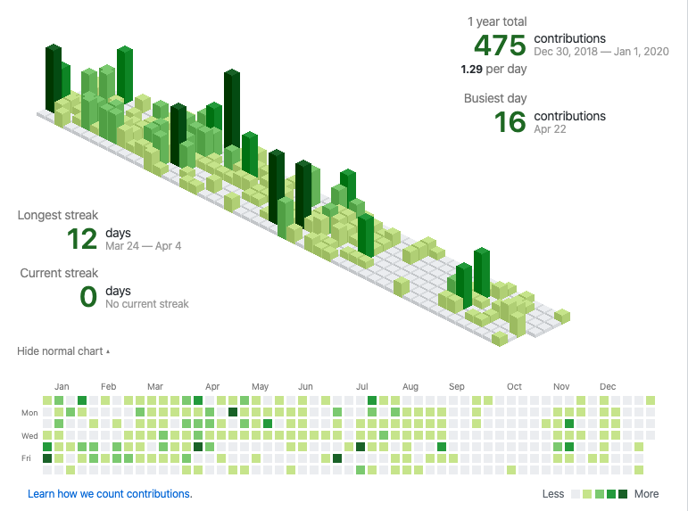
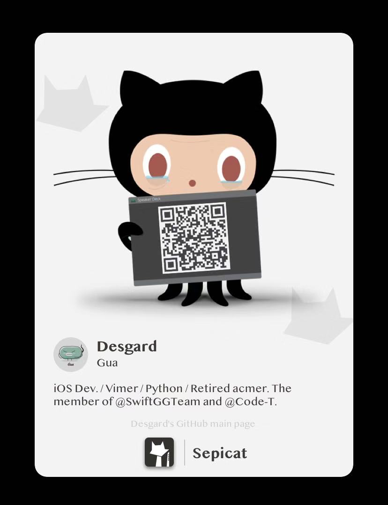
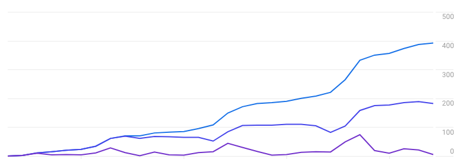
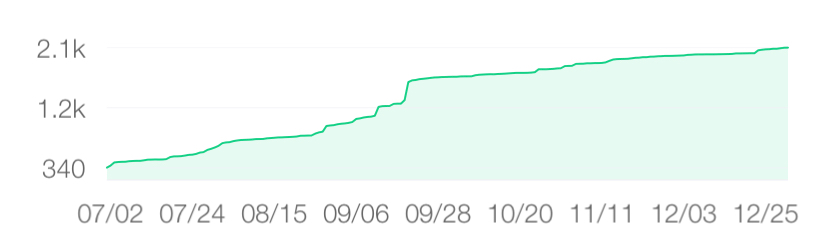
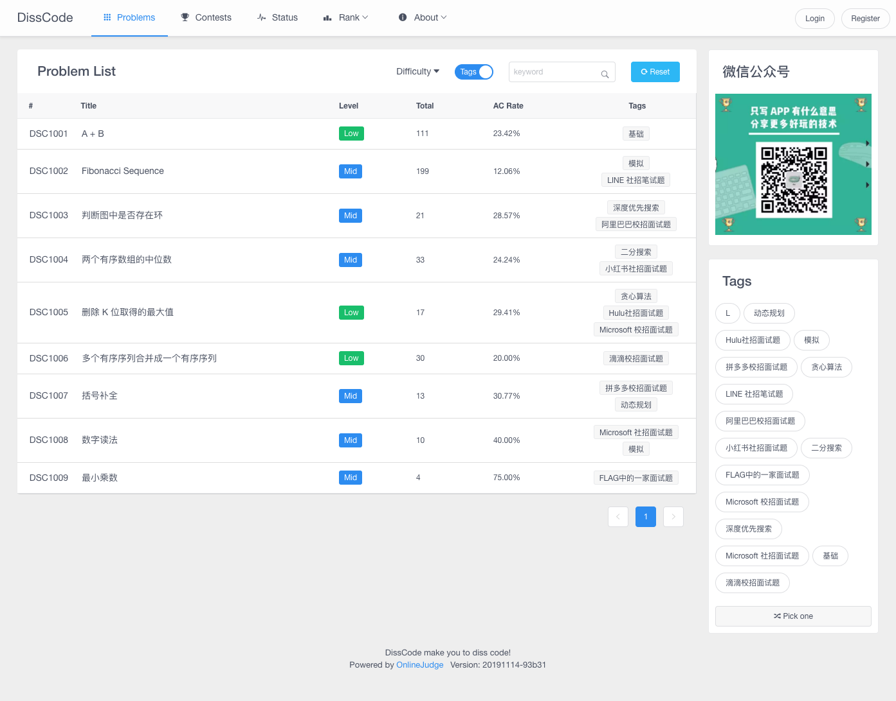
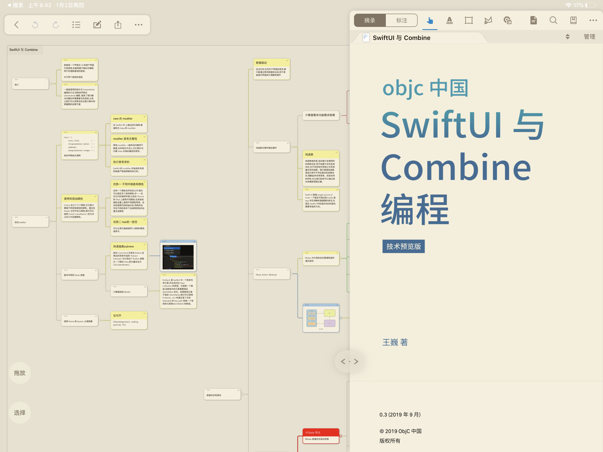
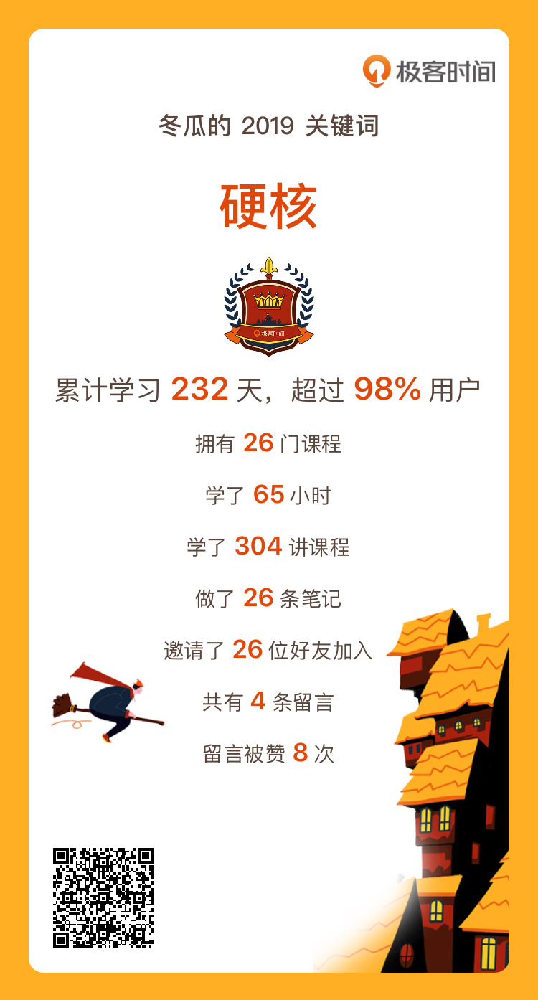
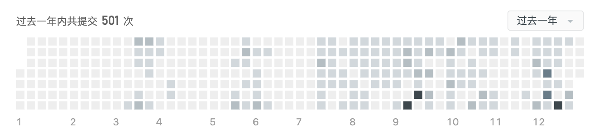
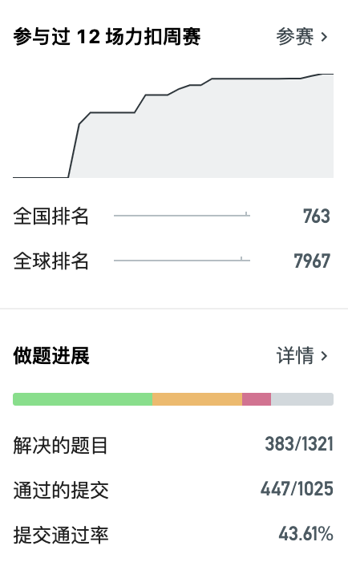

写文之前先回顾了一下 2018 年的[一些计划](https://www.desgard.com/summary-2018/)，可以说是只完成了一半！感觉每年的年终总结越来越朝着 OKR 的方式演化，变成了一种激进的目标！话不多说，我来总结一下全年做了一些什么事情。

# 代码

平均每天 `1.29` 次 `Commit`。由于在年终的时候，听闻 `GitHub` 官方会出客户端，所以在七月份的时候，也就没有对 Sepicat 的开发。但是不得不说，在维护 `Sepicat` 这个小项目的时候，仍旧体会到了很多独立开发的乐趣，包括一些设计的感觉、应用社交性体验。`Sepicat` 我一直想将其做成那种可以对外分享自己的仓库以及个人主页。如果移动端有一种可以通过二维码的方式来分享自己的开源项目，那一定是一件很酷的事情。

这里放一张使用 `Sepicat` 生成的个人主页的名片，感觉还是很有情怀的：

对于 Sepicat 的 App “复活”上线，我希望能在 2020 年完成。毕竟是为了那些付费购买的朋友。当然如果你已经购买了，但是由于删除而此时无法安装的，你可以在下面留言。无论是博客还是公众号，我会送你一杯奶茶或咖啡！😁

# 博客、公众号和平台

今年下半年开始重整博客与公众号的运营，这是给自己一个持续保持技术输出的计划。也想通过这个契机，打造一下个人的技术影响力。博客仍旧是输出一些有自己思考和想法的技术文章，而公众号偏向于面试类，主要从语言特性和基础算法的角度。

其实数据还是很不错的，从 4 月份以来，将博客的数据平台由百度迁移至 Google Analytics，很荣幸博客每日的 `PV` 能到 `200` 左右，其访问的用户已经突破了 5k。非常感谢大家的支持，如果对博客内容有疑问，或者想一起讨论技术，也随时欢迎大家留言。

下图是有效 `PV` 的趋势图，由于是重新迁移至 `Google Analytics`，所以是从 0 开始记录的。

另外，我的技术公众号《让技术一瓜共食》（`tech_gua`）也是我下半年主要投入精力的一件事情。

说来好玩，做公众号的起因其实是和**胖虎（公众号《努力的胖虎》）**、**世杰（公众号《复利维他命》）**在第一次约饭的时候聊起的。虽然目前公众号的红利已经过去，但是微信仍旧拥有 8 亿的用户群，其分享和传播的效果是其他平台无法比拟的。另外还有一点，就是程序员其实是一个年轻的手艺，它无法让我们永远拥有较为稳定的收入，虽然公众号也没有，但起码值得一试。

说干就干就是我们的风格。学习运营技术、学习增长方式、沟通多个号主相互引流，这一切的背后其实都是运营的方法论。下图是公众号自七月（开始运营）以来到现在的粉丝增长情况，整体也在朝着一个增长态势攀升。

年度文章归档大家可以查看公众号的 2019 文章总汇那一篇文章，另外这里要感谢一下共同运营的 **@SketchK** 基友，创建了 **Swift Tips 专栏**以及为我绘制了全套文章头图！😄

> 可以浏览 [让技术一瓜共食 - 2019 年文章归档](https://mp.weixin.qq.com/s/v-yB2_ArfeQAhveHXfiIYA) 来查看今年写的所有公众号技术文章。

由于公众号中分享了很多算法知识的缘故，我从大多读者口中了解到当他们看到理论知识后，并没有一个地方来练习和巩固这些知识。于是为了配套公众号上的部分算法内容，我二次开发了 `QDUOJ`，上线了一个算法平台：`DissCode`（[http://disscode.com/](http://disscode.com/)）。

目前这个平台只有 9 道题目，以朋友们提供的各大互联网公司的面试题目为主。但我希望这个平台可以帮助更多的人去落地理论，从而更加有效的学习算法知识。

目前平台的注册用户已经有 200+ 个，在今年我还会努力的去建设这个站点，成为更好玩的学习平台。

# 读书、专栏课程与刷题

**其实 2019 我没有读过什么书**！而且，很多也没有在豆瓣上记录。但是 2019 年因为 iPad Pro 的存在，我彻底摆脱了纸质书！这其实也节省了我不小的成本！

我举例来总结点评一下。

## 技术类

**《SwiftUI 与 Combine 编程》**- 喵神用了几个很有趣的 Demo 来教你入门 `SwiftUI` 和 `Combine`。其中让我印象最深刻的是哪个 Pokemon 例子，很简单的一个 Demo 把主要的 List 和 ScrollView 也全部都覆盖到了。

**《Flutter 实战》**- 这个是中国社区官网的 `Flutter` 电子书，其中通过 Demo 告诉你如何上手 `Flutter`。

**《第一行代码：Android（第2版）》**- `Android` 入门书，不多说了。

**《RayWenderlich: Advanced iOS App Architecture》**和**《objc: App Architecture》**- 这两本专门讲 iOS 的 App 工程架构，和业务没什么关系，有些枯燥。我感觉读过有一个概念即可。

## 非技术类

- 刘慈欣《乡村教师》、《流浪地球》 、《时间移民》、《地球大炮》
- 曹政《你凭什么做好互联网：从技术思维到商业逻辑》
- 柳井正《一胜久败：优衣库全球热卖的秘密》
- 崔永元《有话说》
- 阿伦·拉奥《硅谷百年史：伟大的科技创新与创业历程》
- 张健《区块链：定义未来金融与经济新格局》
- 蔡康永《蔡康永的情商课：为你自己活一次》
- 吉米·索尼《香农传》
- 但赋《时间的玫瑰》

## 在线课程

完整刷完的有两门课程：

- 戴铭《iOS 高手课》
- 宫文学《编译原理之美》

## 刷题

今年下半年由于公众号写算法文章的需要，所以又重新开启了刷题之旅。大学的时候，前前后后刷过 HDU、POJ、UVa 等平台 800 题左右，为了和面试内容接轨，下半年所刷等题目大多都在 LeetCode。另外就是最近开始坚持打 LeetCode 的比赛，也是为数不多我可以 AK 的比赛😂。想想大学的时候打 Codeforces 和 Bestcoder 经常被虐哭的经历（忧伤。

希望这个刷题的习惯可以坚持下去。**不图别的，因为真的很好玩**

# 个人年度 OKR

最开始说了，由于在字节跳动就业，发现 OKR 真的是一个很棒的个人目标管理工具。区别于公司的个人 OKR，这里罗列的是希望对自己业余时间所做的事情做一个小的预期：

- 公众号、博客、平台规划
    - UG 持续增长，公众号粉丝数到达 1.5w；
    - 公众号原创文章坚持创作，达到每个月 >2 篇原创文章；
    - 博客 PV 希望日均能突破 1k；
    - DissCode 题目增长至 50 题；
    - DissCode 上线打卡和答题模式；
    - DissCode 上线 Swift Online Playground 模式；
- 读书、专栏学习和刷题
    - 读 > 10 本非技术类书籍；
    - 读 > 4 本技术类书籍；
    - 精学 >2 门技术专栏课程，不限于互联网技术；
    - LeetCode 刷题数 >500；
    - LeetCode 参加 >20 场比赛；
    - 学习移动开发图像处理技术，目标是刷完 [Learn OpenGL CN](https://learnopengl-cn.github.io/)；
    - 利用图像处理技术，上线一款个人滤镜 App；
- 尝试视频承载知识，打造媒体号
    - 学习视频剪辑，目标是有所产出；
    - 尝试 B 站视频 Up 主，视频作品 >1；
- 复利与生活
    - 受世杰影响，打算尝试投资，希望有额外收入；
    - 从来没出国过，希望能出国游玩一次；

# 随便聊聊工作

其实这篇总结所有的一切还没有设计到工作方面。也许很多小伙伴也比较想了解在抖音的工作生活。抖音基础技术其实是一个和抖音业务联系不大的团队，但是他会服务于业务的研发同学。例如大家平时在用的仓库管理开发工具、合码和 Code Review 平台、编译/打包环节的优化、工程组件化方案、组件二进制方案等等。设计到的技术绝大多数并不是 iOS ，而是前后端和脚本。

在字节工作个人也学习到了很多，我十分认同对技术“不设边界”这种观念，因为一个计算机工程师，如果想更加深刻的了解各个技术环节，才可以更加理解业务难度。**技术只是解决问题的工具！**

# 写在最后

> 立志欲坚不欲锐，成功在久不在速。

也许生活给你了很重的负担，或也许你总是在做一颗柠檬精羡慕着身边的其他人。看各种各样的“成功学”其实并不会给你带来解决问题的捷径，生活就是要打怪升级！

希望 2020 能让我迈出脱离沪漂的第一步！👣

